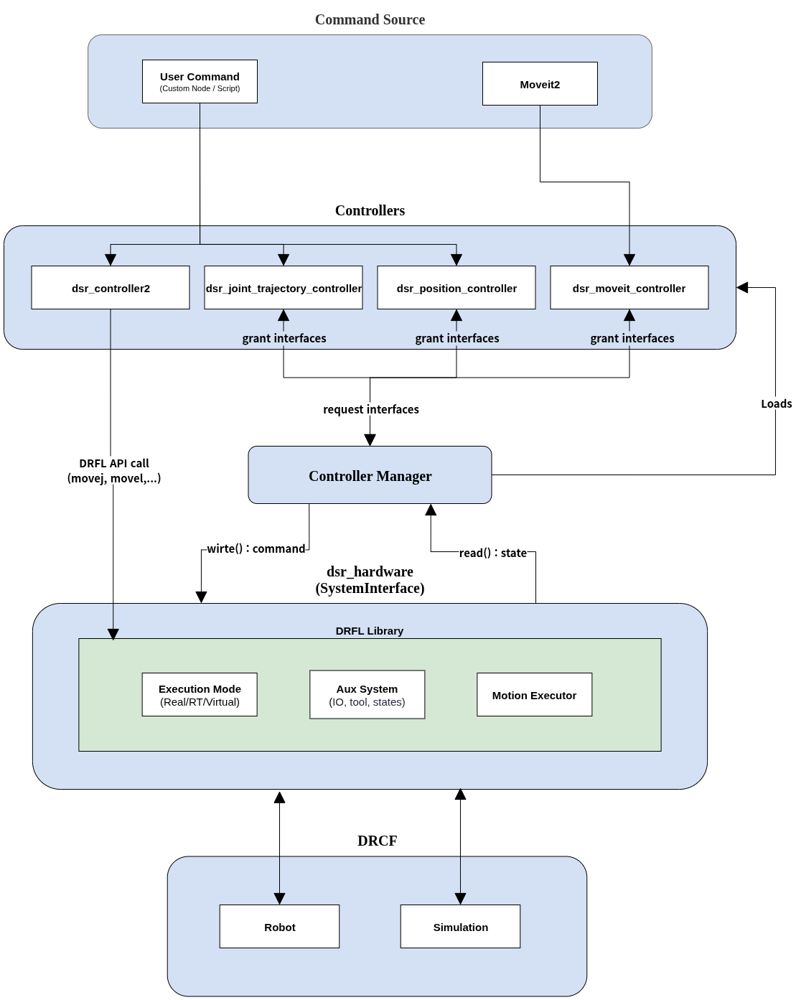

.. _architecture:

Architecture
-------------

This architecture illustrates the data flow between user commands, controller layers, and DRCF (Doosan Robot Control Framework).

.. raw:: html

     

.. raw:: html

     
     

The Doosan ROS 2 control stack follows the standard `ros2_control` architecture.  
It provides a modular interface between user-level applications (e.g., MoveIt 2), control logic, and physical Doosan robot hardware.

.. raw:: html

     

Controller Manager (CM)
~~~~~~~~~~~~~~~~~~~~~~~~~~

The **Controller Manager** is responsible for managing and executing control loops.  
It loads and activates controllers such as `JointTrajectoryController` for arm motion.  
In the Doosan setup, the controller manager interacts with the `dsr_hardware2` plugin, which represents the robot hardware.

The CM’s `update()` loop follows this cycle:

1. **read()** – Read sensor data from the robot via `dsr_hardware2`.
2. **controller update** – Execute the control logic (e.g., trajectory tracking).
3. **write()** – Send joint commands back to the robot through `dsr_hardware2`.

The CM also exposes ROS 2 services for controller lifecycle operations.

.. raw:: html

     

Controllers
~~~~~~~~~~~~~

In the Doosan ROS 2 control system, controllers are modular plugins that perform feedback-based motion control.  
Each controller compares the desired trajectory (reference) with the current joint state and computes the necessary control commands.

Controllers are implemented as classes derived from ``ControllerInterface`` and are loaded using the ``pluginlib`` library.

Common examples include:

- ``JointTrajectoryController``: Handles arm motion through trajectory interpolation.
- ``GripperCommandController``: Sends simple open/close commands to a gripper.
- ``ForwardCommandController``: Sends direct position or velocity commands.

The Doosan control package (`dsr_bringup2`) includes the following custom controllers:

- ``dsr_controller2``: Provides direct command-level access to the DRFL API (`movej`, `movel`, etc.).
- ``dsr_joint_trajectory``: Executes buffered joint trajectories using the Doosan native motion engine.
- ``dsr_moveit_controller``: Standard ``JointTrajectoryController`` compatible with MoveIt 2.
- ``dsr_position_controller``: A ``ForwardCommandController`` for position control of each joint.

Controllers operate on a lifecycle model (``LifecycleNode``) and transition through states such as ``unconfigured``, ``inactive``, and ``active``.

During the control loop, the ``update()`` method is called to:

- Read the latest joint states (via the ``state_interface``)
- Compute control commands
- Write to the ``command_interface`` (e.g., position, velocity)

.. raw:: html

     

User Interfaces
~~~~~~~~~~~~~~~~~

Users interact with the control system primarily via **Controller Manager services**.  
These services allow dynamic loading, activation, deactivation, and switching of controllers at runtime.

Example usage with CLI:

.. code-block:: bash

   ros2 control list_controllers
   ros2 control load_controller joint_trajectory_controller
   ros2 control set_controller_state --activate joint_trajectory_controller

You can also interface with the controller manager using:

- RViz2 GUI (via MoveIt 2)
- Custom ROS 2 nodes
- Python or C++ service clients

For a complete list of available services, refer to ``controller_manager_msgs/srv/``.

.. raw:: html

     

Hardware Components
~~~~~~~~~~~~~~~~~~~~~~~

In the Doosan system, the robot is abstracted as a single **System** hardware component using the `dsr_hardware2` plugin.

This system interface provides:

- **State Interfaces**: Current joint positions and velocities
- **Command Interfaces**: Target joint positions and velocities

Key features:

- Communicates with the physical robot via the DRFL API
- Supports both **real** and **virtual** robot modes
- Implements the required `read()` and `write()` methods for hardware synchronization
