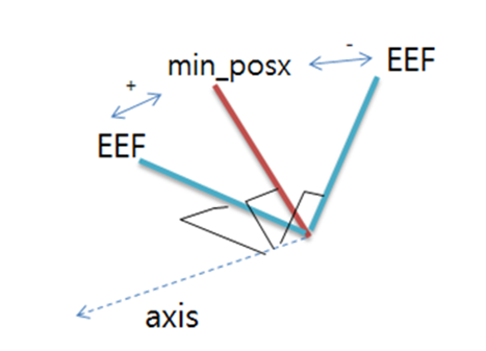
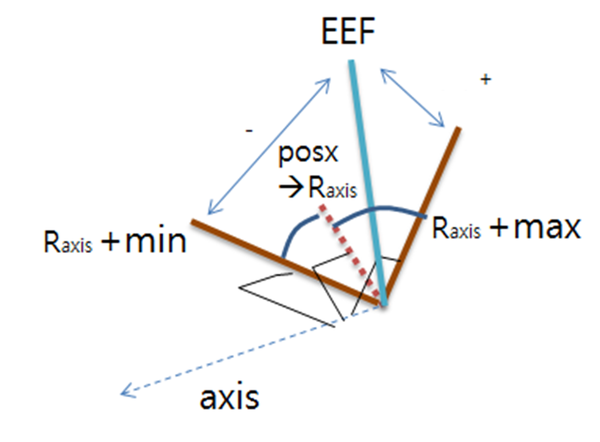

.. _force_services:

force Services
==============

.. contents::
   :depth: 1
   :local:

.. _AlignAxis1:

AlignAxis1
----------
This service matches the normal vector of the plane consists of points(x1, x2, x3) 
based on the ref coordinate(refer to get_normal(x1, x2, x3)) and the designated axis of the tool frame. 
The current position is maintained as the TCP position of the robot.

**Request:**

.. code-block::

   float64[6] x1                # task pos(posx)  
   float64[6] x2                # task pos(posx)  
   float64[6] x3                # task pos(posx)
   float64[3] source_vect       # source vector[3]  
   int8       axis              # DR_AXIS_X(0), DR_AXIS_Y(1), DR_AXIS_Z(2) 
   int8       ref               # DR_BASE(0), DR_WORLD(2), user coord(101~200)
                                # <ref is only available in M2.40 or later> 

**Response:**

.. code-block::

   bool       success

.. _AlignAxis2:

AlignAxis2
----------
This service matches the given vect direction based on the ref coordinate and the designated axis of the tool frame. 
The current position is maintained as the TCP position of the robot.

**Request:**

.. code-block::

   float64[3] target_vect       # target vector[3]  
   float64[3] source_vect       # source vector[3]  
   int8       axis              # DR_AXIS_X(0), DR_AXIS_Y(1), DR_AXIS_Z(2) 
   int8       ref               # DR_BASE(0), DR_WORLD(2), user coord(101~200)
                                # <ref is only available in M2.40 or later> 

**Response:**

.. code-block::

   bool       success 

.. _CalcCoord:

CalcCoord
---------

This service is only available in M2.50 or later.

- **1 pose**: Defined by the position and orientation of x1.
- **2 poses + mode 0**:
  - X-axis: direction from x1 to x2
  - Z-axis: projection of current Tool-Z onto the plane orthogonal to the X-axis
  - Origin: position of x1
- **2 poses + mode 1**:
  - X-axis: direction from x1 to x2
  - Z-axis: projection of x1’s Z-axis onto the plane orthogonal to the X-axis
  - Origin: position of x1
- **3 poses**:
  - X-axis: direction from x1 to x2
  - Z-axis: cross product of X-axis and (x1→x3)
  - Origin: position of x1
- **4 poses**: Same axis definition as with 3 poses, but origin is the position of x4.

**Request:**

.. code-block::

   int8       input_pos_cnt     # input_pos_cnt
   float64[6] x1                # task pos(posx)  
   float64[6] x2                # task pos(posx)  
   float64[6] x3                # task pos(posx)
   float64[6] x4                # task pos(posx)
   int8       ref               # DR_BASE(0), DR_WORLD(2)
   int8       mod               # input mode(only valid when the number of input poses is 2)
                                # 0: defining z-axis based on the current Tool-z direction
                                # 1: defining z-axis based on the z direction of x1 

**Response:**

.. code-block::

   float64[6] conv_posx         # task pos(posx) 
   bool       success

.. _CheckForceCondition:

CheckForceCondition
-------------------

This service checks the status of the given force. It disregards the force direction and only compares the sizes. 
This condition can be repeated with the while or if statement. Measuring the force, axis is based on the ref coordinate and measuring the moment,
axis is based on the tool coordinate.

**Request:**

.. code-block::

   int8       axis              # DR_AXIS_X(0), DR_AXIS_Y(1), DR_AXIS_Z(2), DR_AXIS_A(10), DR_AXIS_B(11), DR_AXIS_C(12) 
   float64    min               # min >=0.0   
   float64    max               # max >=0.0 
   int8       ref     #= 0      # DR_BASE(0), DR_TOOL(1), DR_WORLD(2), user coord(101~200)
                                # <DR_WORLD is only available in M2.40 or later> 

**Response:**

.. code-block::

   bool       success                 # True or False

.. _CheckOrientationCondition1:

CheckOrientationCondition1
--------------------------
This service compares the robot end-effector’s current pose with a specified pose and returns the angular difference (in radians) using the **AngleAxis** method.

- Returns True if the difference is positive (+), False if the difference is negative (−).
- Used to check the sign of the difference for orientation limit conditions (e.g., in ``while`` or ``if`` statements).

**Conditions:**
- **Min only**: True if the difference is positive (+), False if negative (−).
- **Min & Max**: True if the difference from min is negative (−) and from max is positive (+), False otherwise.
- **Max only**: True if the difference from max is positive (+), False otherwise.

**Request:**

.. code-block::

   int8       axis              # DR_AXIS_A(10), DR_AXIS_B(11), DR_AXIS_C(12) 
   float64[6] min               # task pos(posx)  
   float64[6] max               # task pos(posx)  
   int8       ref  #= 0         # DR_BASE(0), DR_TOOL(1), DR_WORLD(2), user_coordinate(101~200)
                                # <DR_WORLD is only available in M2.40 or later> 
   int8       mode #= 0         # DR_MV_MOD_ABS(0)

**Response:**

.. code-block::

   bool success                 # True or False

.. _CheckOrientationCondition2:

CheckOrientationCondition2
--------------------------
This service compares the robot end-effector's current pose with a defined rotation angle range and calculates the difference (in radians) using the **AngleAxis** method.

**Return Value:**

- ``True`` if the difference is positive (+)
- ``False`` if the difference is negative (-)

**Usage:**

This service can be used to determine whether the current pose is within an orientation limit.  
It can be incorporated into conditional statements such as ``while`` or ``if``.

**Conditions:**

- **Min only**: Returns ``True`` if the difference is positive (+), otherwise ``False``.
- **Min & Max**: Returns ``True`` if the difference from *min* is negative (-) **and** the difference from *max* is positive (+), otherwise ``False``.
- **Max only**: Returns ``True`` if the difference from *max* is positive (+), otherwise ``False``.

**Request:**

.. code-block::

   int8       axis              # DR_AXIS_A(10), DR_AXIS_B(11), DR_AXIS_C(12) 
   float64    min               # minimum value  
   float64    max               # maximum value  
   int8       ref  #= 0         # DR_BASE(0), DR_TOOL(1), DR_WORLD(2), user_coordinate(101~200)
                                # <DR_WORLD is only available in M2.40 or later> 
   int8       mode #= 1         # DR_MV_MOD_REL(1)
   float64[6] pos               # task pos(pos)  

**Response:**

.. code-block::

   bool success                 # True or False

.. note::
   
   Range of rotating angle: This means the relative angle range (min, max) based on the specified axis from a given position based on the ref coordinate.

.. _CheckPositionCondition:

CheckPositionCondition
----------------------
This service checks the status of the given position. 
This condition can be repeated with the while or if statement. Axis and pos of input paramets are based on the ref coordinate.

**Request:**

.. code-block::

   int8       axis              # DR_AXIS_X(0), DR_AXIS_Y(1), DR_AXIS_Z(2) 
   float64    min               # min    
   float64    max               # max  
   int8       ref     #= 0      # DR_BASE(0), DR_TOOL(1), DR_WORLD(2), user_coordinate(101~200)
                                # <DR_WORLD is only available in M2.40 or later> 
   int8       mode #= 0         # DR_MV_MOD_ABS(0), DR_MV_MOD_REL(1) 
   float64[6] pos               # task pos(posx)  

**Response:**

.. code-block::

   bool success                 # True or False

.. _CoordTransform:

CoordTransform
--------------
This service converts a given task position from a source reference coordinate system (``ref_in``) to a target reference coordinate system (``ref_out``),  
and returns the transformed task position.

**Supported Transformations:**

+---------+-------+-------+-------+-------+-------+-------+-------+-------+-------+-------+-------+-------+-------+-------+-------+
| ref_in  | World | World | World | World | Base  | Base  | Base  | Tool  | Tool  | Tool  | Tool  | User  | User  | User  | User  |
+---------+-------+-------+-------+-------+-------+-------+-------+-------+-------+-------+-------+-------+-------+-------+-------+
| ref_out | World | Base  | Tool  | User  | Base  | Tool  | User  | World | Base  | Tool  | User  | World | Base  | Tool  | User  |
+---------+-------+-------+-------+-------+-------+-------+-------+-------+-------+-------+-------+-------+-------+-------+-------+

**Request:**

.. code-block::

   float64[6] pos_in            # task pos(posx)  
   int8       ref_in            # DR_BASE(0), DR_TOOL(1), DR_WORLD(2), user coord(101~200)
                                # <ref is only available in M2.40 or later> 
   int8       ref_out           # DR_BASE(0), DR_TOOL(1), DR_WORLD(2), user coord(101~200) 
                                # <ref is only available in M2.40 or later> 

**Response:**

.. code-block::

   float64[6] conv_posx         # task pos(posx)
   bool       success

.. _GetUserCartCoord:

GetUserCartCoord
----------------

This service is only available in M2.50 or later
This service returns the pose and reference coordinate system of the requested user coordinate system [id].

**Request:**

.. code-block::

   int8       id                # ID of user coord 

**Response:**

.. code-block::

   float64[6] conv_posx         # task pos(posx)  
   int8       ref               # Reference coordinate of the coordinate to get
   bool       success

.. _GetWorkpieceWeight:

GetWorkpieceWeight
------------------
This service measures and returns the weight of the workpiece.

**Request:**
.. code-block::

   (None)

**Response:**

.. code-block::

   float32       weight               # Measured weight, Negative value if error
   bool          success

.. _IsDoneBoltTightening:

IsDoneBoltTightening
--------------------
This service monitors the tightening torque of the tool and returns True if the set torque (m) is reached within the given time and False if the given time has passed.

**Request:**

.. code-block::

   float64    m                 # Target torque  
   float64    timeout           # Monitoring duration [sec]  
   int8       axis              # DR_AXIS_X(0), DR_AXIS_Y(1), DR_AXIS_Z(2) 

**Response:**

.. code-block::

   bool       success

.. _OverwriteUserCartCoord:

OverwriteUserCartCoord
----------------------

This service is only available for M2.50 or later versions.  
It changes the pose and reference coordinate system of the requested user coordinate system [id] with the given ``pos`` and ``ref``.

**Request:**

.. code-block::

   int8       id                # ID of user coord 
   float64[6] pos               # task pos(posx)  
   int8       ref        #= 0   # DR_BASE(0), DR_WORLD(2)

**Response:**

.. code-block::

   int8       id                # Successful coordinate setting, Set user coordinate ID (101 - 200)
                                # (-1) Failed coordinate setting
   bool       success                             

.. _ParallelAxis1:

ParallelAxis1
-------------
This service matches the normal vector of the plane consists of points(x1, x2, x3) based on the ref coordinate(refer to get_normal(x1, x2, x3)) 
and the designated axis of the tool frame. The current position is maintained as the TCP position of the robot.

**Request:**

.. code-block::

   float64[6] x1                # task pos(posx)  
   float64[6] x2                # task pos(posx)  
   float64[6] x3                # task pos(posx)
   int8       axis              # DR_AXIS_X(0), DR_AXIS_Y(1), DR_AXIS_Z(2) 
   int8       ref        #= 0   # DR_BASE(0), DR_WORLD(2), user coord(101~200)
                                # <ref is only available in M2.40 or later> 

**Response:**

.. code-block::

   bool       success 

.. _ParallelAxis2:

ParallelAxis2
-------------
This service matches the given vect direction based on the ref coordinate and the designated axis of the tool frame. 
The current position is maintained as the TCP position of the robot.

**Request:**

.. code-block::

   float64[3] vect              # vector[3]  
   int8       axis              # DR_AXIS_X(0), DR_AXIS_Y(1), DR_AXIS_Z(2) 
   int8       ref        #= 0   # DR_BASE(0), DR_WORLD(2), user coord(101~200)
                                # <ref is only available in M2.40 or later> 

**Response:**

.. code-block::

   bool       success 

.. _ReleaseComplianceCtrl:

ReleaseComplianceCtrl
---------------------
This service releases the current compliance control and restores the robot to normal operation mode.

**Request:**

.. code-block::

   (None)

**Response:**

.. code-block::

   bool       success 

.. _ReleaseForce:

ReleaseForce
------------
This service reduces the force control target value to 0 through the time value and returns the task space to adaptive control.

**Request:**

.. code-block::

   float64    time # 0          # Time needed to reduce the force (0 ~ 1.0) 

**Response:**

.. code-block::

   bool       success 

.. _ResetWorkpieceWeight:

ResetWorkpieceWeight
--------------------

This service resets the stored workpiece weight data, initializing the algorithm before a new weight measurement.

**Request:**

.. code-block::

   (None)

**Response:**

.. code-block::

   bool       success 

.. _SetDesiredForce:

SetDesiredForce
---------------
This service defines the target force, direction, translation time, and mode for force control based on the global coordinate.

**Request:**

.. code-block::

   float64[6] fd                # Three translational target forces + Three rotational target moments
   int8[6]    dir               # Force control in the corresponding direction if 1, Compliance control in the corresponding direction if 0
   int8       ref               # Reference coordinate of the coordinate to get
   float64    time # 0          # Transition time of target force to take effect (0 ~ 1.0 sec)
   int8       mod               # DR_FC_MOD_ABS(0): force control with absolute value, 
                                # DR_FC_MOD_REL(1): force control with relative value to initial state (the instance when this function is called) 

**Response:**

.. code-block::

   bool       success

.. _SetStiffnessx:

SetStiffnessx
-------------
This service sets the stiffness value based on the global coordinate(refer to set_ref_coord()). 
The linear transition from the current or default stiffness is performed during the time given as STX. 
The user-defined ranges of the translational stiffness and rotational stiffness are 0-20000N/m and 0-400Nm/rad, respectively.

**Request:**

.. code-block::

   float64[6] stx               # default[500, 500, 500, 100, 100, 100], Three translational stiffnesses + Three rotational stiffnesses
   int8       ref               # the preset reference coordinate system.
   float64    time              # Stiffness varying time(0 ~ 1.0) [sec], Linear transition during the specified time   

**Response:**

.. code-block::

   bool       success 

.. _SetUserCartCoord1:

SetUserCartCoord1
-----------------

This service sets a new user Cartesian coordinate system using the given input pose ``pos`` and reference coordinate system ``ref``.  
Up to 20 user coordinate systems can be set, including those created within the Workcell Item.  
Since the coordinate system set by this function is removed when the program is terminated,  
it is recommended to set new coordinate systems within the Workcell Item for persistence.

**Request:**

.. code-block::

   float64[6] pos                # task pos(posx)  
   int8       ref                # DR_BASE(0), DR_WORLD(2)
                                 # <ref is only available in M2.40 or later> 

**Response:**

.. code-block::

   int8        id                # set user coord (101~120) or fail(-1)
   bool        success    

.. _SetUserCartCoord2:

SetUserCartCoord2
-----------------
This service defines a new rectangular coordinate system using points **x1**, **x2**, and **x3** based on a given reference coordinate system.

**Axis Definition:**

- **ux**: Unit vector from x1 to x2  
  - *Before M2.0.2*: Unit vector from x2 to x1
- **uy**: Unit vector representing the shortest distance from the line x1x2 to point x3
- **uz**: Derived from the cross product of **ux** and **uy**
- **Origin**: ``pos`` in the reference coordinate system

**Limitations:**

- Maximum of 20 coordinate systems can be stored.
- If more than 20 are created, only the most recent 20 are retained.

**Request:**

.. code-block::

   float64[6] x1                 # task pos(posx)  
   float64[6] x2                 # task pos(posx)  
   float64[6] x3                 # task pos(posx)
   float64[6] pos                # pos(posx)
   int8       ref                # DR_BASE(0), DR_WORLD(2)
                                 # <ref is only available in M2.40 or later> 

**Response:**

.. code-block::

   int8    id                    # set user coord (101~200) or fail(-1) 
   bool        success   

.. _SetUserCartCoord3:

SetUserCartCoord3
-----------------
This service defines a new rectangular coordinate system using vectors **u1** and **v1** based on a given reference coordinate system.

**Definition:**
- **Origin**: ``pos`` in the reference coordinate system
- **X-axis**: Vector **u1**
- **Y-axis**: Vector **v1**
   
   - If **u1** and **v1** are not orthogonal, a corrected vector **v1’** is used, which is perpendicular to **u1** on the plane defined by **u1** and **v1**

- **Z-axis**: Determined by the cross product **u1 × v1**

**Request:**

.. code-block::

   float64[3] u1                # X-axis unit vector  
   float64[3] v1                # Y-axis unit vector 
   float64[6] pos               # task pos(posx) 
   int8       ref               # DR_BASE(0), DR_WORLD(2)
                                # <ref is only available in M2.40 or later> 

**Response:**

.. code-block::

   int8    id                   # set user coord (101~120) or fail(-1) 
   bool        success   

.. _TaskComplianceCtrl:

TaskComplianceCtrl
------------------

This service begins task compliance control based on the preset reference coordinate system.

**Request:**

.. code-block::

   float64[6] stx               # Three translational stiffnesses + Three rotational stiffnesses
                                # default  [3000, 3000, 3000, 200, 200, 200]
   int8       ref               # the preset reference coordinate system.
   float64    time              # Stiffness varying time [ 0 ~ 1.0 sec], Linear transition during the specified time 

**Response:**

.. code-block::

   bool       success
