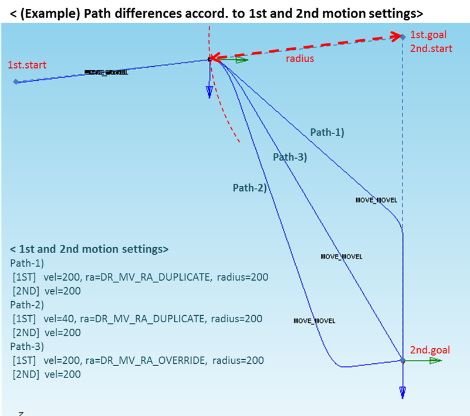
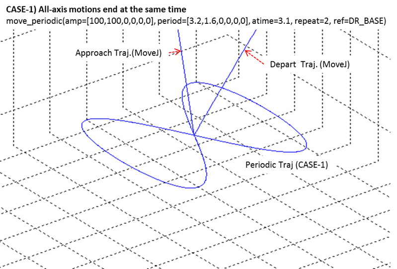
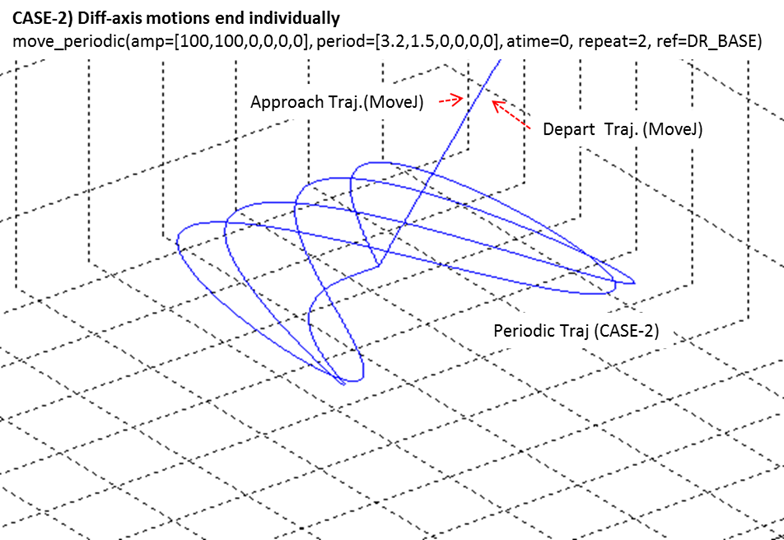

.. _motion_services:

Motion Services
===============

.. contents::
   :depth: 1
   :local:

.. _Trans:

Trans
-----

- Translates/rotates the input pose (``pos``) by ``delta`` in the ``ref`` coordinate, then returns the result expressed in ``ref_out``.
- If ``ref`` is **DR_TOOL**, the result is returned in the input pose’s frame and ``ref_out`` is **ignored**.

**Request:**

.. code-block::

   float64[6] pos               # task pos (posx)
   float64[6] delta             # delta (posx)
   int8       ref     #= 0      # DR_BASE(0), DR_TOOL(1), DR_WORLD(2)
                                # <DR_WORLD is only available in M2.40 or later>
   int8       ref_out #= 0      # DR_BASE(0), DR_WORLD(2)
                                # <ref_out is only available in M2.40 or later>

**Response:**

.. code-block::

   float64[6] trans_pos         # transformed pos (posx)
   bool       success

.. note::

   - The ``ref`` argument value ``DR_WORLD`` is available in **M2.40 or later**.
   - The ``ref_out`` argument is available in **M2.40 or later**.

.. _FKIN:

Fkin
----

Converts joint angles (``float64[6]``) to TCP pose (task space) in the specified reference frame.

**Request:**

.. code-block::

   float64[6] pos               # joint pos (posj)
   int8       ref     #= 0      # DR_BASE(0), DR_WORLD(2)
                                # <ref is only available in M2.40 or later>

**Response:**

.. code-block::

   float64[6] conv_posx         # task pos (posx)
   bool       success

.. note::

   The ``ref`` argument is available in **M2.40 or later**.

.. _Ikin:

Ikin
----

Returns the joint position for the given task pose and **solution space** (0–7).

**Request:**

.. code-block::

   float64[6] pos               # task pos (posx)
   int8       sol_space         # solution space : 0 ~ 7
   int8       ref     #= 0      # DR_BASE(0), DR_WORLD(2)
                                # <ref is only available in M2.40 or later>

**Response:**

.. code-block::

   float64[6] conv_posj         # joint pos (posj)
   bool       success

.. note::

   The ``ref`` argument is available in **M2.40 or later**.

.. _SetRefCoord:

SetRefCoord
-----------

Sets the system-wide reference coordinate.

**Request:**

.. code-block::

   int8       coord             # DR_BASE(0), DR_TOOL(1), DR_WORLD(2), user coord(101~200)
                                # <DR_WORLD is only available in M2.40 or later>

**Response:**

.. code-block::

   bool success

.. note::

   ``DR_WORLD`` is available in **M2.40 or later**.

.. _MoveJoint:

MoveJoint
---------

Moves from the current joint position to the target joint position (``pos``).

**Request:**

.. code-block::

   float64[6] pos               # target joint angles [deg]
   float64    vel               # velocity [deg/s]
   float64    acc               # acceleration [deg/s^2]
   float64    time   #= 0.0     # time [s]
   float64    radius #= 0.0     # blending radius [mm]
   int8       mode   #= 0       # MOVE_MODE_ABSOLUTE=0, MOVE_MODE_RELATIVE=1
   int8       blend_type #= 0   # BLENDING_SPEED_TYPE_DUPLICATE=0, BLENDING_SPEED_TYPE_OVERRIDE=1
   int8       sync_type  #= 0   # SYNC=0, ASYNC=1

**Response:**

.. code-block::

   bool success

.. note::

   If ``time`` is specified, the motion is executed **time-based** and ``vel``/``acc`` are **ignored**.

.. _MoveJointx:

MoveJointx
----------

Moves to a **task-space target** (``pos`` in posx form) using **joint-space** motion.  
Path linearity is **not guaranteed**. One of 8 robot configurations (solution space) must be specified.

**Request:**

.. code-block::

   float64[6] pos               # target task pose (posx)
   float64    vel               # velocity [deg/s]
   float64    acc               # acceleration [deg/s^2]
   float64    time   #= 0.0     # time [s]
   float64    radius #= 0.0     # blending radius [mm]
   int8       ref               # DR_BASE(0), DR_TOOL(1), DR_WORLD(2)
                                # <DR_WORLD is only available in M2.40 or later>
   int8       mode   #= 0       # MOVE_MODE_ABSOLUTE=0, MOVE_MODE_RELATIVE=1
   int8       blend_type #= 0   # BLENDING_SPEED_TYPE_DUPLICATE=0, BLENDING_SPEED_TYPE_OVERRIDE=1
   int8       sol               # solution space : 0 ~ 7
   int8       sync_type  #= 0   # SYNC=0, ASYNC=1

**Response:**

.. code-block::

   bool success

.. note::

   - If ``time`` is specified, the motion is executed **time-based** and ``vel``/``acc`` are **ignored**.
   - Using blending in the **preceding motion** with **relative mode** (``mode = MOVE_MODE_RELATIVE``) causes an error; prefer blending with ``MoveJoint`` or ``MoveLine``.
   - The ``ref`` argument value ``MOVE_REFERENCE_WORLD`` is available in **M2.40 or later**.
   - See ``MoveJoint`` and ``MoveLine`` for details on blending, ``radius``, and velocity/acceleration behavior.

.. _MoveLine:

MoveLine
--------

Moves along a straight line in task space to the target pose (``pos``).

**Request:**

.. code-block::

   float64[6] pos               # target task pose (posx)
   float64[2] vel               # [linear mm/s, angular deg/s]
   float64[2] acc               # [linear mm/s^2, angular deg/s^2]
   float64    time   #= 0.0     # time [s]
   float64    radius #= 0.0     # blending radius [mm]
   int8       ref               # DR_BASE(0), DR_TOOL(1), DR_WORLD(2)
                                # <DR_WORLD is only available in M2.40 or later>
   int8       mode   #= 0       # MOVE_MODE_ABSOLUTE=0, MOVE_MODE_RELATIVE=1
   int8       blend_type #= 0   # BLENDING_SPEED_TYPE_DUPLICATE=0, BLENDING_SPEED_TYPE_OVERRIDE=1
   int8       sync_type  #= 0   # SYNC=0, ASYNC=1

**Response:**

.. code-block::

   bool success

.. raw:: html

    
    

.. note::

   - If ``vel`` is provided (e.g., ``vel=[30, 0]``), it specifies the **linear** velocity; the **angular** velocity is set **proportionally** to this linear velocity.
   - If ``acc`` is provided (e.g., ``acc=[60, 0]``), it specifies the **linear** acceleration; the **angular** acceleration is set **proportionally** to this linear acceleration.
   - If ``time`` is specified, the motion is executed **time-based** and ``vel``/``acc`` are **ignored**.
   - The ``ref`` argument value ``MOVE_REFERENCE_WORLD`` is available in **M2.40 or later**.

.. caution::

   When blending with ``blend_type = BLENDING_SPEED_TYPE_DUPLICATE`` and ``radius > 0``, the **preceding motion may terminate when the following motion finishes** if the preceding motion’s remaining time (based on remaining distance, velocity, and acceleration) **exceeds** the following motion’s time. Refer to the image for details.

.. _MoveCircle:

MoveCircle
----------

Moves along an arc to target ``pos2`` via waypoint ``pos1``, or rotates by a specified angle from the current pose (task space).

**Request:**

.. code-block::

   std_msgs/Float64MultiArray[] pos  # two poses: pos1, pos2 (each 6)
   float64[2]      vel               # [linear mm/s, angular deg/s]
   float64[2]      acc               # [linear mm/s^2, angular deg/s^2]
   float64         time   #= 0.0     # time [s]
   float64         radius #= 0.0     # blending radius [mm]
   int8            ref               # DR_BASE(0), DR_TOOL(1), DR_WORLD(2)
                                     # <DR_WORLD is only available in M2.40 or later>
   int8            mode   #= 0       # MOVE_MODE_ABSOLUTE=0, MOVE_MODE_RELATIVE=1
   float64         angle1 #= 0.0     # [deg]
   float64         angle2 #= 0.0     # [deg]
   int8            blend_type #= 0   # BLENDING_SPEED_TYPE_DUPLICATE=0, BLENDING_SPEED_TYPE_OVERRIDE=1
   int8            sync_type  #= 0   # SYNC=0, ASYNC=1

**Response:**

.. code-block::

   bool success

.. image:: images/movecircle.png
   :alt: ROS2 Interface
   :width: 80%
   :align: center

.. raw:: html

    
    

.. note::

   - If ``vel`` is provided (e.g., ``vel=[30, 0]``), it specifies the **linear** velocity; the **angular** velocity is set **proportionally** to this linear velocity.
   - If ``acc`` is provided (e.g., ``acc=[60, 0]``), it specifies the **linear** acceleration; the **angular** acceleration is set **proportionally** to this linear acceleration.
   - If ``time`` is specified, the motion is executed **time-based** and ``vel``/``acc`` are **ignored**.
   - The ``ref`` argument value ``MOVE_REFERENCE_WORLD`` is available in **M2.40 or later**.
   - If ``mode = MOVE_MODE_RELATIVE``, ``pos[0]`` and ``pos[1]`` are **relative**:  
     ``pos[0]`` to the start pose, ``pos[1]`` to ``pos[0]``.
   - If **one angle** is provided, it is the **total rotation** along the arc.  
     If **two angles** are provided, ``angle1`` is the constant-velocity angle and ``angle2`` is the accel/decel angle; total rotation is ``angle1 + 2 × angle2``.

.. caution::

   When blending with ``blend_type = BLENDING_SPEED_TYPE_DUPLICATE`` and ``radius > 0``, the **preceding motion may terminate when the following motion finishes** if its remaining time **exceeds** the following motion’s time.

.. _MoveSplineJoint:

MoveSplineJoint
---------------

Moves along a spline in **joint space** through the given waypoints to the final target.  
The given velocity/acceleration act as **maximums**; actual accel/decel depends on waypoint placement.

**Request:**

.. code-block::

   std_msgs/Float64MultiArray[] pos  # up to 100 joint waypoints [6 each]
   int8       pos_cnt                # number of targets
   float64[6] vel                    # joint velocity limits [deg/s]
   float64[6] acc                    # joint acceleration limits [deg/s^2]
   float64    time     #= 0.0        # time [s]
   int8       mode     #= 0          # MOVE_MODE_ABSOLUTE=0, MOVE_MODE_RELATIVE=1
   int8       sync_type #= 0         # SYNC=0, ASYNC=1

**Response:**

.. code-block::

   bool success

.. note::

   - If ``time`` is specified, the motion is **time-based**; ``vel``/``acc`` are **ignored**.
   - If ``mode = MOVE_MODE_RELATIVE``, each ``pos`` in ``pos_list`` is defined **relative to the previous joint pose**.  
     For example, with ``pos_list = [q1, q2, ..., q(n)]``: ``q1`` is relative to the start pose, ``q(n)`` is relative to ``q(n-1)``.
   - Online blending of previous/subsequent motions is **not supported**.

.. _MoveSplineTask:

MoveSplineTask
--------------

Moves along a spline in **task space** through the given waypoints to the final target.  
The given velocity/acceleration act as **maximums**; if the constant-velocity option is selected, constant-speed segments are used where applicable.

**Request:**

.. code-block::

   std_msgs/Float64MultiArray[] pos  # task-space waypoints
   int8            pos_cnt           # number of targets
   float64[2]      vel               # [linear mm/s, angular deg/s]
   float64[2]      acc               # [linear mm/s^2, angular deg/s^2]
   float64         time   #= 0.0     # time [s]
   int8            ref               # DR_BASE(0), DR_TOOL(1), DR_WORLD(2)
                                     # <DR_WORLD is only available in M2.40 or later>
   int8            mode  #= 0        # MOVE_MODE_ABSOLUTE=0, MOVE_MODE_RELATIVE=1
   int8            opt   #= 0        # SPLINE_VELOCITY_OPTION_DEFAULT=0, SPLINE_VELOCITY_OPTION_CONST=1
   int8            sync_type #= 0    # SYNC=0, ASYNC=1

**Response:**

.. code-block::

   bool success

.. note::

   - If ``vel`` is provided (e.g., ``vel=[30, 0]``), it specifies the **linear** velocity; the **angular** velocity is set **proportionally** to this linear velocity.
   - If ``acc`` is provided (e.g., ``acc=[60, 0]``), it specifies the **linear** acceleration; the **angular** acceleration is set **proportionally** to this linear acceleration.
   - If ``time`` is specified, the motion is executed **time-based** and ``vel``/``acc`` are **ignored**.
   - The ``ref`` argument value ``MOVE_REFERENCE_WORLD`` is available in **M2.40 or later**.
   - If ``mode = MOVE_MODE_RELATIVE``, each element of ``pos_list`` is **relative** to the previous element.
   - Online blending of previous/subsequent motions is **not supported**.

.. caution::

   If ``opt = SPLINE_VELOCITY_OPTION_CONST`` (constant-velocity), **constant velocity between waypoints may not be achievable**.  
   In such cases, motion **falls back** to variable-velocity mode (``SPLINE_VELOCITY_OPTION_DEFAULT``).

.. _MoveBlending:

MoveBlending
------------

Executes a sequence of **line/circle segments** at (approximately) constant speed, blending each segment with the specified radius (``posb``).

**Request:**

.. code-block::

   std_msgs/Float64MultiArray[] segment  # up to 50: pos1[6]:pos2[6]:type[1]:radius[1]
   int8           pos_cnt                # number of segments
   float64[2]     vel                    # [linear mm/s, angular deg/s]
   float64[2]     acc                    # [linear mm/s^2, angular deg/s^2]
   float64        time    #= 0.0         # time [s]
   int8           ref                     # DR_BASE(0), DR_TOOL(1), DR_WORLD(2)
                                          # <DR_WORLD is only available in M2.40 or later>
   int8           mode   #= 0             # MOVE_MODE_ABSOLUTE=0, MOVE_MODE_RELATIVE=1
   int8           sync_type #= 0          # SYNC=0, ASYNC=1

**Response:**

.. code-block::

   bool success

.. note::

   - If ``vel`` is provided (e.g., ``vel=[30, 0]``), it specifies the **linear** velocity; the **angular** velocity is set **proportionally** to this linear velocity.
   - If ``acc`` is provided (e.g., ``acc=[60, 0]``), it specifies the **linear** acceleration; the **angular** acceleration is set **proportionally** to this linear acceleration.
   - If ``time`` is specified, the motion is executed **time-based** and ``vel``/``acc`` are **ignored**.
   - The ``ref`` argument value ``MOVE_REFERENCE_WORLD`` is available in **M2.40 or later**.
   - If ``mode = MOVE_MODE_RELATIVE``, each ``pos`` in ``posb_list`` is **relative** to the previous position.

.. caution::

   - Error if the **blending radius** in ``posb`` is **0**.
   - Error for **duplicate Line inputs** when **contiguous Line–Line** segments have the **same direction**.
   - Error if the blending condition would cause a **rapid direction change** (to prevent sudden acceleration).
   - Online blending of previous/subsequent motions is **not supported**.

.. _MoveSpiral:

MoveSpiral
----------

Executes a spiral trajectory on the plane **perpendicular to the specified axis** (``task_axis``) with axial translation.

**Request:**

.. code-block::

   float64    revolution        # total number of turns
   float64    max_radius        # final spiral radius [mm]
   float64    max_length        # axial travel distance [mm] (negative = negative axis direction)
   float64[2] vel               # [linear mm/s, angular deg/s]
   float64[2] acc               # [linear mm/s^2, angular deg/s^2]
   float64    time    #= 0.0    # total execution time [s]
   int8       task_axis         # TASK_AXIS_X=0, TASK_AXIS_Y=1, TASK_AXIS_Z=2
   int8       ref     #= 1      # DR_BASE(0), DR_TOOL(1), DR_WORLD(2)
                                # <DR_WORLD is only available in M2.40 or later>
   int8       sync_type #= 0    # SYNC=0, ASYNC=1

**Response:**

.. code-block::

   bool success

.. note::

   - ``revolution``: number of spiral turns.
   - ``max_radius``: final spiral radius.
   - ``max_length``: axial travel distance (negative means negative axis direction).
   - If ``time`` is specified, the motion is **time-based** and ``vel``/``acc`` are **ignored**.
   - The ``ref`` argument value ``MOVE_REFERENCE_WORLD`` is available in **M2.40 or later**.
   - Online blending of previous/subsequent motions is **not supported**.

.. caution::

   An error may be raised for safety if the computed **rotational acceleration** is too large.  
   Reduce ``vel``, ``acc``, or ``time``.

.. _MovePeriodic:

MovePeriodic
------------

Performs cyclic sine motion on each axis (translation/rotation) of the selected reference frame, as a **relative** motion from the current pose.  
Amplitudes and periods set the per-axis motion; accel/decel time and repetition count set timing.

**Request:**

.. code-block::

   float64[6] amp               # amplitude per axis [mm]/[deg], motion between -amp and +amp
   float64[6] periodic          # period per axis [s]
   float64    acc               # accel/decel time [s]
   int8       repeat            # repetition count (reference axis drives total duration)
   int8       ref    #= 1       # DR_BASE(0), DR_TOOL(1), DR_WORLD(2)
                                # <DR_WORLD is only available in M2.40 or later>
   int8       sync_type #= 0    # SYNC=0, ASYNC=1

**Response:**

.. code-block::

   bool success

.. raw:: html

    
    

.. note::

   - ``amp``: ``[x, y, z, rx, ry, rz]``; axes without motion **must be 0**.
   - ``periodic``: per-axis periods (used as “period” in the velocity formula below).
   - ``acc``: accel/decel time. Effective value is ``max(acc, max(periodic)/4)``.  
     Error if ``acc > total_motion_time / 2``.
   - ``repeat``: set for the **reference axis** (largest period); other axes’ repetitions are auto-adjusted.
   - On normal termination, some axes may finish earlier to return to the start pose; decel segments may deviate if axes do not finish simultaneously.
   - ``ref``: repeated motion reference frame. ``MOVE_REFERENCE_WORLD`` is available in **M2.40 or later**.
   - Max velocity guidance:

     .. math::

        v_{\max} \approx \frac{\text{amp} \times 2\pi}{\text{period}}

     Example: ``amp = 10 mm``, ``period = 1 s`` → ``v_{\max} \approx 62.83 mm/s``.
   - Online blending of previous/subsequent motions is **not supported**.

.. caution::

   If a **maximum velocity error** occurs, reduce amplitude or increase period (see formula).

.. _MoveWait:

MoveWait
--------

Waits until the **current motion finishes** before proceeding to the next command.

**Request:**

.. code-block::

   (None)

**Response:**

.. code-block::

   bool success

.. _MovePause:

MovePause
---------

Decelerates and **pauses** the current motion.  
Ignored if no motion is in progress.

**Request:**

.. code-block::

   (None)

**Response:**

.. code-block::

   bool success

.. _MoveResume:

MoveResume
----------

**Resumes** a paused motion.  
Ignored if no path motion is in progress.

**Request:**

.. code-block::

   (None)

**Response:**

.. code-block::

   bool success

.. _MoveStop:

MoveStop
--------

Stops robot motion according to the specified stop mode.

**Request:**

.. code-block::

   int32 stop_mode      # DR_QSTOP_STO(0) : Quick stop (Stop Cat. 1 without STO)
                        # DR_QSTOP(1)     : Quick stop (Stop Cat. 2)
                        # DR_SSTO(2)      : Soft Stop
                        # DR_HOLD(3)      : HOLD stop

**Response:**

.. code-block::

   bool success

.. _Jog:

Jog
---

Performs jog control on a single axis.

Resulting jog speed = **(250 mm/s) × speed [%]**

**Request:**

.. code-block::

   int8    jog_axis        # 0~5: JOINT1~6, 6~11: TASK X,Y,Z,rx,ry,rz
   int8    move_reference  # 0: MOVE_REFERENCE_BASE, 1: MOVE_REFERENCE_TOOL
   float64 speed           # jog speed [%] : + forward, 0 stop, - backward

**Response:**

.. code-block::

   bool success

.. _JogMulti:

JogMulti
--------

Performs multi-axis jog control.

Multi-axis jog speed = **(250 mm/s) / √3 × [unit vector] × speed [%]**

Available in controller software **2.50 or later**.

**Request:**

.. code-block::

   float64[6] jog_axis     # unit vector in task space [Tx, Ty, Tz, Rx, Ry, Rz] : -1.0 ~ +1.0
   int8       move_reference  # 0: BASE, 1: TOOL, 2: WORLD
   float64    speed        # jog speed [%]

**Response:**

.. code-block::

   bool success

.. _CheckMotion:

CheckMotion
-----------

Returns the status of the **currently active motion**.

**Request:**

.. code-block::

   (None)

**Response:**

.. code-block::

   int8  status   # DR_STATE_IDLE(0): no motion
                  # DR_STATE_INIT(1): motion being calculated
                  # DR_STATE_BUSY(2): motion in operation
   bool  success

.. _ChangeOperationSpeed:

ChangeOperationSpeed
--------------------

Adjusts operation velocity as a **percentage** (1–100) of the currently set speed.  
For example, ``50`` reduces the speed to **50%**.

**Request:**

.. code-block::

   int8 speed              # 1~100 [%]

**Response:**

.. code-block::

   bool success

.. _EnableAlterMotion:

EnableAlterMotion
-----------------

Available in **M2.40 or later**. Configures how ``alter_motion()`` inputs affect the current trajectory.  
Base cycle is **100 ms**; set to ``n × 100 ms`` via ``n``.  
Modes: **Accumulation** (absolute offset ``[dX,dY,dZ,dRX,dRY,dRZ]``) and **Increment** (increment added to previous absolute offset).  
Reference frame via ``ref``.  
Limits: ``limit_dpos`` (max accumulated) and ``limit_dpos_per`` (max per-cycle increment); applied values are clamped.

**Request:**

.. code-block::

   int32      n                 # cycle multiplier (cycle = n × 100 ms)
   int8       mode              # DR_DPOS(0): accumulation, DR_DVEL(1): increment
   int8       ref               # DR_BASE(0), DR_TOOL(1), DR_WORLD(2), user coord(101~200)
                                # <ref is only available in M2.40 or later>
   float64[2] limit_dpos        # [position mm, orientation deg]
   float64[2] limit_dpos_per    # per-cycle limits [position mm, orientation deg]

**Response:**

.. code-block::

   bool success

.. _AlterMotion:

AlterMotion
-----------

Available in **M2.40 or later**. Applies the altering amount to the motion trajectory when alter is enabled.  
Input semantics are defined by ``EnableAlterMotion``.

**Request:**

.. code-block::

   float64[6] pos               # altering amount [dX,dY,dZ,dRX,dRY,dRZ]

**Response:**

.. code-block::

   bool success

.. note::

   - ``alter_motion()`` can be executed only in a **user thread**.
   - Limits are controlled by ``limit_dpos`` / ``limit_dpos_per`` set in ``EnableAlterMotion``.
   - Input orientation follows **fixed XYZ** notation.

.. caution::

   ``alter_motion()`` can be executed only in a **user thread**.

.. _DisableAlterMotion:

DisableAlterMotion
------------------

Available in **M2.40 or later**. Deactivates alter motion.

**Request:**

.. code-block::

   (None)

**Response:**

.. code-block::

   bool success

.. _SetSingularityHandling:

SetSingularityHandling
----------------------

Selects the response policy when potential **path deviation due to kinematic singularity** is detected.

- **Auto Avoidance (default)** — ``SINGULARITY_AVOIDANCE_AVOID``  
  Reduces instability via automatic avoidance; may reduce path-tracking accuracy.
- **Path First** — ``SINGULARITY_AVOIDANCE_STOP``  
  Prioritizes path: decelerates, warns, then **stops** if instability is likely.
- **Velocity Variable** — ``SINGULARITY_AVOIDANCE_VEL``  
  Improves path tracking with reduced instability; **TCP speed varies** in singular regions.

**Request:**

.. code-block::

   int8  mode   # DR_AVOID(0): Auto avoidance
                # DR_TASK_STOP(1): Decel / Warn / Stop
                # DR_VAR_VEL(2): Variable velocity

**Response:**

.. code-block::

   bool success

.. _MoveHome:

MoveHome
--------

Performs homing by moving in joint space to the **mechanical** or **user-defined** home position.

**Request:**

.. code-block::

   int8  target   # DR_HOME_TARGET_MECHANIC(0): mechanical home (0,0,0,0,0,0)
                  # DR_HOME_TARGET_USER(1): user home

**Response:**

.. code-block::

   int8  res      # 0=success, otherwise failure code
   bool  success
