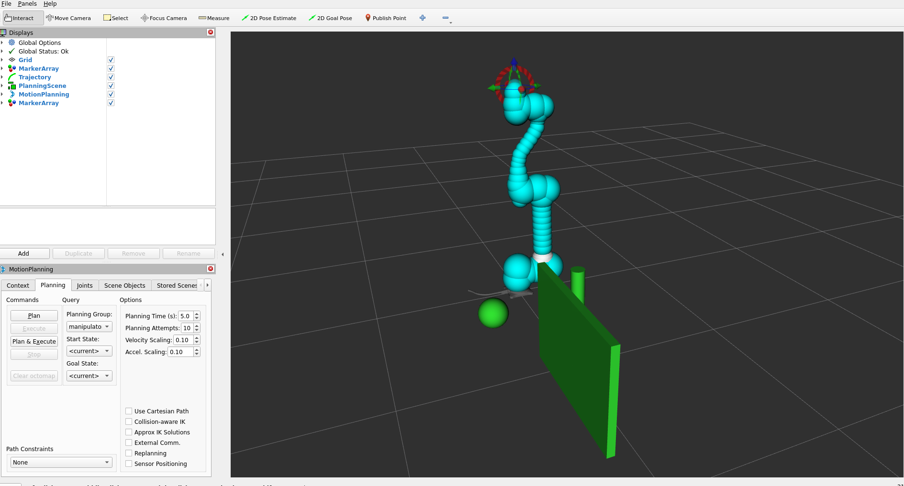

.. _cumotion_tutorial:

cuMotion Integration
====================

Overview
--------

**cuMotion** provides GPU-accelerated motion planning for Doosan robots by integrating
NVIDIA Isaac ROS with MoveIt 2 and the ROS 2 control stack.

This tutorial describes how to set up the full software environment and execute
the cuMotion-based motion planning pipeline.

.. note::

   This tutorial is based on the following validated environment:

   - Isaac ROS: **Release 3.2**
   - NVIDIA Driver: **570**
   - CUDA: **12.8** (Docker base: 12.6)
   - ROS 2: **Humble**

.. raw:: html

    
    

System Prerequisites
-------------------------------------------------

Before configuring cuMotion, you **must complete the official Isaac ROS base setup**
provided by **NVIDIA**. Only after completing the guide below, proceed with the Doosan + cuMotion integration
steps described below. : `Official Isaac ros setup guide <https://nvidia-isaac-ros.github.io/v/release-3.2/getting_started/index.html>`_ 

.. note::
   In official setup guide, you must complete both steps:

   1. Compute setup
   2. Developer Environment Setup

.. warning::
   Installing 560 drivers may cause compatibility issues with GPU-accelerated Docker containers due to
   driver/runtime mismatches.
   It is recommended to use the latest stable driver version (e.g., 570 series) to ensure compatibility with Isaac ROS and cuMotion.

.. raw:: html

    
    

Workspace Setup
----------------

This section describes the process of creating separate and independent workspaces for the **NVIDIA Isaac ROS cuMotion** stack 
and the Doosan ROS 2 robot control stack. By isolating these two environments, 
the system maintains a clean separation between GPU-accelerated core motion planning (Isaac ROS + cuMotion) and vendor-specific robot hardware control (Doosan ROS 2).

Isaac ROS Workspace
~~~~~~~~~~~~~~~~~~~~

.. code-block:: bash

   mkdir -p ~/workspaces/isaac_ros-dev/src
   echo 'export ISAAC_ROS_WS="${HOME}/workspaces/isaac_ros-dev/"' >> ~/.bashrc
   source ~/.bashrc
   cd ~/workspaces/isaac_ros-dev/src

   git clone --recursive -b release-3.2 https://github.com/NVIDIA-ISAAC-ROS/isaac_ros_common.git
   git clone --recursive -b release-3.2 https://github.com/NVIDIA-ISAAC-ROS/isaac_ros_cumotion.git

Doosan ROS 2 + cuMotion Workspace
~~~~~~~~~~~~~~~~~~~~~~~~~~~~~~~~~~~

.. code-block:: bash

   mkdir -p ~/ros2_ws/src
   cd ~/ros2_ws/src

   git clone -b humble https://github.com/DoosanRobotics/doosan-robot2.git
   git clone -b humble https://github.com/DoosanRobotics/doosanrobotics_cumotion_driver

.. raw:: html

    
    

Container Execution
-------------------------------------------------

This step initializes and launches the Docker-based runtime environments required for the full cuMotion and Doosan ROS 2 integration. 
The startup-doosan.sh script prepares the Doosan cuMotion Docker environment by configuring the build context, applying required settings, 
and starting the Doosan-specific container for robot control and execution.

Next, the ``run_dev.sh`` script launches the NVIDIA Isaac ROS development container, which provides the GPU-accelerated runtime environment 
for cuMotion and motion planning.

Command
~~~~~~~~

- **Doosan cuMotion Docker Startup**

.. code-block:: bash

   cd ~/ros2_ws/src/cumotion/dsr_cumotion/docker
   chmod +x startup-doosan.sh
   ./startup-doosan.sh

.. code-block:: bash

   cd ~/workspaces/isaac_ros-dev/src/isaac_ros_common/scripts
   ./run_dev.sh

- **Environment Setup**

.. code-block:: bash

   source /opt/ros/humble/setup.bash
   source /workspaces/isaac_ros-dev/install/setup.bash
   source /workspaces/ros2_ws/install/setup.bash

.. raw:: html

    
    

cuMotion Launch
-------------------------------------------------

This section launches the full cuMotion-based motion planning and execution pipeline for the Doosan robot in either real hardware mode or virtual simulation mode.
In ``real`` mode, the system establishes a direct network connection to the physical robot controller using the specified IP address 
and executes trajectories on the real hardware through the ROS 2 control interface.
In ``virtual mode``, the same motion planning pipeline is executed against a
simulated robot instance, allowing safe algorithm testing, parameter tuning, and integration validation without physical hardware.

Command
~~~~~~~~

- **Real Robot Mode**

  .. code-block:: bash

     ros2 launch dsr_cumotion start_cumotion.launch.py \
       mode:=real host:=192.168.137.100 gripper:=none

- **Virtual Robot Mode**

  .. code-block:: bash

     ros2 launch dsr_cumotion start_cumotion.launch.py \
       mode:=virtual host:=127.0.0.1 gripper:=none

.. raw:: html

    

.. raw:: html

    
    

Gripper Configuration
~~~~~~~~~~~~~~~~~~~~~~

**Arguments**

- ``gripper:=none``   – Robot only  
- ``gripper:=vgc10``  – OnRobot VGC10  
- ``gripper:=2f85``   – Robotiq 2F-85  

.. list-table::
   :widths: 33 33 33
   :align: center

   * - .. container:: align-center

          .. image:: ../images/cumotion/cumotion_gripper_none.png
             :width: 200px
          
          **No gripper**

     - .. container:: align-center

          .. image:: ../images/cumotion/cumotion_gripper_vgc10.png
             :width: 200px
          
          **OnRobot VGC10**

     - .. container:: align-center

          .. image:: ../images/cumotion/cumotion_gripper_2f85.png
             :width: 200px
          
          **Robotiq 2F-85**

.. warning::

   - Robotiq 2F-85 is supported **only in virtual mode**
   - VGC10 gripper controller is not launched automatically and must be started separately

**cuMotion Launch Arguments**

.. list-table::
   :header-rows: 1
   :widths: 20 20 60

   * - Argument
     - Default
     - Description
   * - ``mode``
     - ``real``
     - Selects the execution environment. ``real`` connects to the physical Doosan robot, while ``virtual`` runs the Doosan Emulator or simulation environment.
   * - ``host``
     - ``127.0.0.1``
     - Target controller address. Use the real robot controller IP in ``real`` mode, or the emulator host IP (local emulator uses ``127.0.0.1``) in ``virtual`` mode.
   * - ``model``
     - ``m1013``
     - Robot model selection. Currently, **only the M1013 model is supported**.
   * - ``gripper``
     - ``none``
     - End-effector configuration. ``none`` loads the robot only, ``vgc10`` loads the OnRobot VGC10 model (controller must be started separately), and ``2f85`` loads the Robotiq 2F-85 model (**virtual mode only**).
   * - ``enable_nvblox``
     - ``false``
     - Enables real-time 3D environment reconstruction using NVBlox. This option requires high GPU memory and should be disabled on laptops or low-memory GPUs to allow **cuMotion-only operation**.
   * - ``enable_cumotion``
     - ``true``
     - Enables the cuMotion GPU-accelerated motion planning node.
   * - ``enable_attach``
     - ``true``
     - Enables the object attach/detach interface for pick-and-place operations.
   * - ``obstacle``
     - ``true``
     - Enables static obstacle generation through the MoveIt PlanningScene.
   * - ``use_sim_time``
     - ``false``
     - Selects the time source. ``false`` uses system wall time (must be used in ``real`` mode), and ``true`` enables simulated time for virtual environments.

.. note::
   When specifying the ``host`` argument, note that different values are required
   depending on the operation mode.  
   For **virtual mode**, the host address must always be fixed to ``127.0.0.1``.  
   For **real mode**, it is recommended to use an address in the ``192.168.137.x`` range,  
   which must match the IP configured on the robot's TP.

cuMotion Planning Demo
~~~~~~~~~~~~~~~~~~~~~~~

The following examples illustrate how cuMotion performs real-time, GPU-accelerated
motion planning directly from the MoveIt RViz interface.  
Simply dragging the TCP marker and selecting **Plan and Execute** triggers cuMotion
to generate and execute an optimized trajectory on the robot.

.. raw:: html

    

**1. Basic Plan & Execute**

This demo shows a straightforward target pose update in RViz.  

.. image:: ../images/cumotion/cumotion_demo_basic.gif
   :alt: cuMotion Basic Planning Demo
   :width: 800px
   :align: center

.. raw:: html

   
<i>Figure: Basic motion planning with cuMotion from a dragged TCP target.</i>

    

**2. Obstacle-Aware Planning**

This example demonstrates how cuMotion dynamically avoids obstacles in the environment.  
Even with complex constraints, the GPU-accelerated planner quickly searches for a safe,
collision-free trajectory.

.. image:: ../images/cumotion/cumotion_demo_obstacle.gif
   :alt: cuMotion Obstacle Avoidance Demo
   :width: 800px
   :align: center

.. raw:: html

   
<i>Figure: cuMotion computes an optimized trajectory that safely avoids obstacles.</i>

     

.. raw:: html

    
    

Motion Command Topics
----------------------

Pose Command
~~~~~~~~~~~~~
This command moves the end-effector to an **absolute target pose in the robot base frame**.  
It is used when both the target **position and orientation** need to be explicitly specified.

.. code-block:: bash

   ros2 topic pub /target_pose dsr_cumotion_msgs/msg/TargetPose "{
     x: 0.35, y: 0.20, z: 0.40,
     rx: 90.0, ry: 0.0, rz: 180.0,
     max_vel_scale: 0.5, max_acc_scale: 0.4
   }" --once

TargetPose.msg
^^^^^^^^^^^^^^

This message defines an **absolute target TCP pose**.  
The orientation can be represented using **either Euler angles or a quaternion**.

.. code-block:: bash

   # TargetPose.msg
   # Absolute Cartesian pose command (Euler angles)
   # Orientation (either quaternion or euler, one of them can be 0)

   float64 x                  # Target position (m)
   float64 y
   float64 z
   float64 rx                 # Target orientation (deg) - Roll
   float64 ry                 # Pitch
   float64 rz                 # Yaw

   # Optional parameters
   float64 qx
   float64 qy
   float64 qz
   float64 qw

   float64 max_vel_scale      # Velocity scaling (0.0 ~ 1.0, 0 means default)
   float64 max_acc_scale      # Acceleration scaling (0.0 ~ 1.0, 0 means default)

Joint Command
~~~~~~~~~~~~~~
This command moves the robot in **joint space by directly specifying each joint angle**.  
It is used when only the **target joint configuration** is required, without defining a Cartesian path.

.. code-block:: bash

   ros2 topic pub /target_joint dsr_cumotion_msgs/msg/TargetJoint "{
     joints: [0.0, 0.0, 90.0, 0.0, 90.0, 0.0],
     max_vel_scale: 0.6,
     max_acc_scale: 0.4
   }" --once

TargetJoint.msg
^^^^^^^^^^^^^^^^

This message represents a **joint-space motion command**, where each joint angle is provided as an array.

.. code-block:: bash

   # TargetJoint.msg
   # Joint-space motion command (in radians)

   float64[] joints  # Target joint angles (rad)

   # Optional parameters
   float64 max_vel_scale      # Velocity scaling (0.0 ~ 1.0, 0 means default)
   float64 max_acc_scale      # Acceleration scaling (0.0 ~ 1.0, 0 means default)

Named Command
~~~~~~~~~~~~~~
This command moves the robot to a **predefined named pose (e.g., home, ready)** registered in the `NamedExecutor`.  
It is well-suited for **repetitive motions and initial pose setup**.

.. code-block:: bash

   ros2 topic pub /target_named dsr_cumotion_msgs/msg/TargetNamed "{
     target_name: 'home',
     max_vel_scale: 0.8,
     max_acc_scale: 0.6
   }" --once

TargetNamed.msg
^^^^^^^^^^^^^^^^

This message sends the **name of a predefined target pose** as a string.

.. code-block:: bash

   # TargetNamed.msg
   # Named target command (predefined pose name)

   string target_name          # Example: "home", "ready"

   # Optional parameters
   float64 max_vel_scale       # Velocity scaling (0.0 ~ 1.0, 0 means default)
   float64 max_acc_scale       # Acceleration scaling (0.0 ~ 1.0, 0 means default)

Relative Command (TCP)
~~~~~~~~~~~~~~~~~~~~~~~
This command performs an **incremental (relative) motion** based on the current robot state.  
It is mainly used for **fine adjustments (micro adjustments)** in either the TCP frame or the base frame.

.. code-block:: bash

   ros2 topic pub /target_relative dsr_cumotion_msgs/msg/TargetRelative "{
     reference_frame: 'tcp',
     dx: 0.0, dy: 0.00, dz: 0.20,
     drx: 0.0, dry: 0.0, drz: 0.0,
     max_vel_scale: 0.5,
     max_acc_scale: 0.5
   }" --once

TargetRelative.msg
^^^^^^^^^^^^^^^^^^^

This message specifies **relative translational (dx, dy, dz) and rotational (drx, dry, drz) increments**
with respect to the current TCP or base frame.

.. code-block:: bash

   # TargetRelative.msg
   # Relative motion command with respect to the current pose (Euler angles)

   string reference_frame     # "base" or "tcp" (default: "tcp")

   float64 dx                 # Relative translation (m)
   float64 dy
   float64 dz
   float64 drx                # Relative rotation (deg)
   float64 dry
   float64 drz

   # Optional parameters
   float64 max_vel_scale      # Velocity scaling (0.0 ~ 1.0, 0 means default)
   float64 max_acc_scale      # Acceleration scaling (0.0 ~ 1.0, 0 means default)

.. raw:: html

    
    

Object Attach / Detach
-----------------------
This node serves as an automatic Pick & Place sequence execution server for the Doosan robot.
It performs motion execution using the MoveIt 2 + cuMotion motion planning pipeline, 
and controls object grasping and releasing in simulation through the Isaac ROS AttachObject action,
enabling both attach (grasp) and detach (release) operations.

Attach
~~~~~~~

.. code-block:: bash

   ros2 service call /attach_detach_command dsr_cumotion_msgs/srv/PickPlace "{motion_type: 0}"

Detach
~~~~~~

.. code-block:: bash

   ros2 service call /attach_detach_command dsr_cumotion_msgs/srv/PickPlace "{motion_type: 1}"

Obstacle Manager
-----------------

The ``obstacle_manager`` node is a **dynamic collision object manager** used by both **MoveIt 2 and the cuMotion motion planning pipeline**.
This node loads predefined static and mesh-based obstacles from a YAML configuration file at startup and publishes them to the
MoveIt **Planning Scene**.

At initialization, the node reads the specified YAML file and loads the following obstacle types:

- ``BOX``
- ``SPHERE``
- ``CYLINDER``
- ``MESH``

Each collision object contains the following information:
- Reference coordinate frame (``frame_id``)
- 3D position
- Optional orientation
- Geometric dimensions or mesh scale

For ``MESH`` objects, the node uses the **trimesh** library to load a 3D mesh file (e.g., STL) and converts it into
a ROS-compatible collision object.

In addition, the node subscribes to the ``/collision_remove`` topic, allowing:

- **Selective removal** of a single collision object by ID
- **Complete removal** of all collision objects by publishing an empty string

This enables dynamic environment updates during runtime while maintaining a consistent planning scene
for cuMotion and MoveIt 2.

Usage
~~~~~~

The default obstacle configuration file is: ``dsr_cumotion/config/obstacle.yaml``

If ``frame_id`` is not explicitly specified, it is automatically set to: ``base_link``

Example YAML Configuration
~~~~~~~~~~~~~~~~~~~~~~~~~~

.. code-block:: yaml

   objects:
     - id: {name}
       type: cylinder
       position: [0.0, 0,0, 0.0]
       dimensions: [0.0, 0.0]   # radius, height

     - id: {name}
       type: cylinder
       position: [0.0, 0.0, 0.0]
       dimensions: [0.0, 0.0]   # radius, height

     - id: {name}
       type: cylinder
       position: [0.0, 0.0, 0.0]
       dimensions: [0.0, 0.0]   # radius, height

     - id: {name}
       type: mesh
       mesh_path: "path"         # file path
       position: [0.0, 0.0, 0.0]
       orientation: [0.0, 0.0, 0.0, 1.0]
       scale: [1.0, 1.0, 1.0]

Collision Object Removal
~~~~~~~~~~~~~~~~~~~~~~~~~

Remove a specific object by ID:

.. code-block:: bash

   ros2 topic pub /collision_remove std_msgs/msg/String "{data: 'cyl1'}" --once

Remove all collision objects:

.. code-block:: bash

   ros2 topic pub /collision_remove std_msgs/msg/String "{data: ''}" --once

Launch Integration
~~~~~~~~~~~~~~~~~~~

The obstacle manager is automatically enabled when launching cuMotion with:

::

   obstacle:=true or false

Example:

.. code-block:: bash

   ros2 launch dsr_cumotion start_cumotion.launch.py \
     mode:=virtual \
     host:=127.0.0.1 \
     obstacle:=true

Package Overview
----------------------

This section describes the **core packages** that form the
**Doosan + Isaac ROS + cuMotion integrated system**, including their
roles and key responsibilities within the overall architecture.

``dsr_cumotion``
~~~~~~~~~~~~~~~~

**Role: Core Integration Package for Doosan, MoveIt 2, and cuMotion**

The ``dsr_cumotion`` package is the **central integration layer** of the system.
It connects the following components into a single execution pipeline:

- Doosan ROS 2 hardware interface
- MoveIt 2 motion planning framework
- NVIDIA cuMotion planner execution
- Pick-and-place task server
- Planning scene and static obstacle management

Key Responsibilities
^^^^^^^^^^^^^^^^^^^^

- Provides the **main system launch entry point** (``start_cumotion.launch.py``)
- Configures the **cuMotion and MoveIt 2 planning pipelines**
- Manages **robot model integration**:

  - URDF
  - SRDF
  - XRDF

- Provides a **Pick-and-Place task execution server**
- Manages **static obstacles using the Planning Scene**
- Manages **workspace boundaries (workbound)**

This package directly controls the **core motion planning and execution behavior of the robot**.

.. raw:: html

    

``dsr_cumotion_goal_interface``
~~~~~~~~~~~~~~~~~~~~~~~~~~~~~~~

**Role: Motion Command Dispatch Interface**

The ``dsr_cumotion_goal_interface`` package receives **high-level user commands**
and acts as the **command gateway** that forwards them to the
**MoveIt 2 + cuMotion execution pipeline**.

Key Responsibilities
^^^^^^^^^^^^^^^^^^^^

- Subscribes to the ``/target_pose`` topic
- Selects the appropriate execution strategy based on the command type:

  - Absolute pose motion
  - Joint-space motion
  - Named pose motion
  - Relative TCP motion

- Sends motion goals to the **MoveIt 2 Action Server**
- Monitors execution status and feedback
- Executes commands sequentially using a **multi-command queue**

This package serves as the **intermediate control layer between user commands and physical robot execution**.

.. raw:: html

    

``dsr_cumotion_msgs``
~~~~~~~~~~~~~~~~~~~~~

**Role: System-Wide Message and Service Interface Definition Package**

The ``dsr_cumotion_msgs`` package defines all **custom ROS 2 messages and service types**
used throughout the system for **motion-level and task-level control**.

Key Responsibilities
^^^^^^^^^^^^^^^^^^^^

- Defines the **unified motion command message** that supports:

  - Absolute pose commands
  - Joint commands
  - Named target commands
  - Relative TCP commands

- Defines the **Pick-and-Place task control service interface**, including:

  - Approach → attach → retreat sequence
  - Approach → detach → retreat sequence

- Provides the **standard API contract** between:

  - User applications
  - Command interface nodes
  - Planning and execution subsystems

References
----------

- `cuMotion tutorial <https://nvidia-isaac-ros.github.io/v/release-3.2/repositories_and_packages/isaac_ros_cumotion/index.html>`_
- `cuMotion github <https://github.com/NVIDIA-ISAAC-ROS/isaac_ros_cumotion/tree/release-3.2>`_
