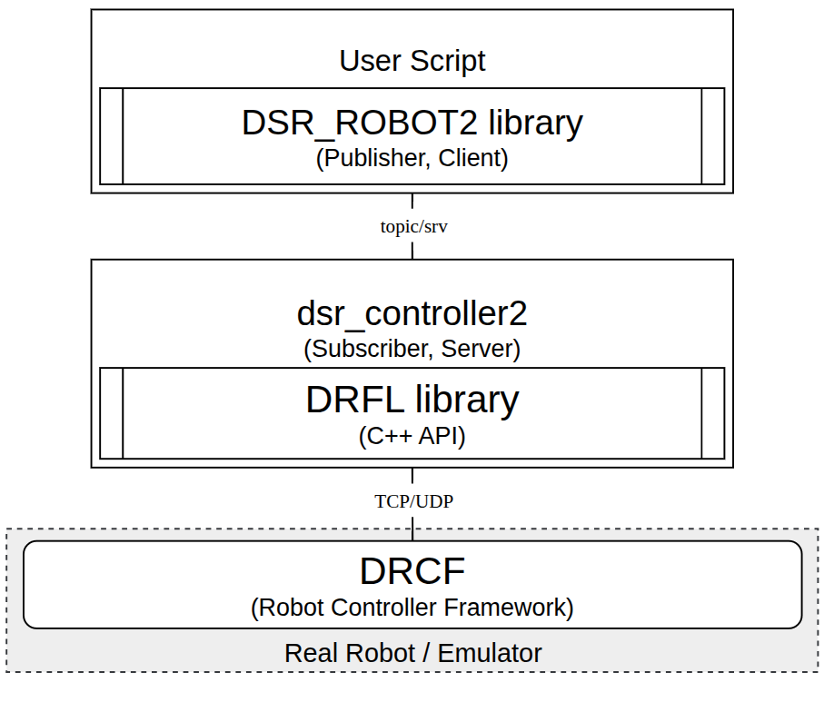

.. _dsr_robot_tutorial:

DSR_ROBOT2 Python Library Tutorial
==================================

Overview
--------

This tutorial provides an overview of the ``DSR_ROBOT2`` Python library and instructions on how to use it for robot control.

The ``DSR_ROBOT2`` library offers a high-level Python interface for controlling Doosan robots within the ROS 2 ecosystem.  
It is designed to simplify robot manipulation by providing a user-friendly API for motion control, configuration, and communication.

Architecture
------------

The ``DSR_ROBOT2`` package acts as a ROS 2 wrapper, enabling robot control through Python scripts.  
The architecture is composed by the following layers:

.. raw:: html

    
    

- **DSR_ROBOT2** (Python Interface): Publishes commands via ROS 2 topics/services and interacts with `dsr_controller2`.
- **dsr_controller2**: Translates ROS 2 service and topic commands into calls to the Doosan robot control library (DRFL).
- **DRFL** (Doosan Robotics Framework Library): C++ API for communicating with the robot controller software.
- **DRCF** (Doosan Robot Controller Framework): The low-level controller running on the robot or emulator.

Quick Start
--------------------------------------

Below is a complete, minimal script to move the robot to a single position. You can save this as a Python file and run it directly after launching the simulation.

.. code-block:: python

    import rclpy
    import DR_init
    import sys

    def main(args=None):
        rclpy.init(args=args)

        ROBOT_ID = "dsr01"
        ROBOT_MODEL = "m1013"
        DR_init.__dsr__id = ROBOT_ID
        DR_init.__dsr__model = ROBOT_MODEL

        node = rclpy.create_node('example_py', namespace=ROBOT_ID)

        DR_init.__dsr__node = node

        from DSR_ROBOT2 import movej, posj, set_robot_mode, ROBOT_MODE_AUTONOMOUS

        set_robot_mode(ROBOT_MODE_AUTONOMOUS)

        target_pos = posj(0, 0, 90.0, 0, 90.0, 0)

        movej(target_pos, vel=100, acc=100)

        print("Example complete")
        rclpy.shutdown()

    if __name__ == '__main__':
        main()

Setup and Launch
----------------

This section explains how to configure and execute basic motion control using the ``DSR_ROBOT2`` interface.

.. note::
   For practical usage, refer to the ``dsr_example2`` package.

**1. Initializing the Robot Configuration**

Before any operation, you must specify the robot's ID and model name. 
The ``DR_init`` module is used to store this configuration.

.. code-block:: python

    import DR_init
    ROBOT_ID   = "dsr01"
    ROBOT_MODEL= "m1013"
    DR_init.__dsr__id   = ROBOT_ID
    DR_init.__dsr__model = ROBOT_MODEL

**2. Setting up the ROS 2 Node**

Communication in ROS 2 is handled through nodes. You must initialize the `rclpy` library and create a node giving the namespace. 
This node is then assigned to the ``DR_init`` module, enabling the library to communicate over the ROS 2 network.

.. code-block:: python

    import rclpy

    rclpy.init(args=args)
    node = rclpy.create_node('single_robot_simple_py', namespace=ROBOT_ID)
    DR_init.__dsr__node = node

**3. Importing Robot Control Functions Needed**

The core functionalities for robot control, such as movement commands and position definitions, are imported from the ``DSR_ROBOT2`` library.

.. code-block:: python

    from DSR_ROBOT2 import movej, movejx, movesj, movesx, movel, movec
    from DSR_ROBOT2 import posj, posx
    from DSR_ROBOT2 import ROBOT_MODE_AUTONOMOUS

.. caution::

    ``DSR_ROBOT2`` import should come after initializing the ROS 2 node (``DR_init.__dsr__node``).

**4. Setting the Robot's Operational Mode and Speed**

Before sending motion commands or settings, the robot must be set to the correct mode.

- ``ROBOT_MODE_AUTONOMOUS`` : The robot can be controlled and moved. 
- ``ROBOT_MODE_MANUAL`` : For robot settings, such as adding tools to the end-effector.

You can also set default global velocities and accelerations if you want.

.. code-block:: python

    set_robot_mode(ROBOT_MODE_AUTONOMOUS)

    set_velx(30, 20)    # Set global task speed: 30(mm/sec), 20(deg/sec)
    set_accx(60, 40)    # Set global task acceleration: 60(mm/sec2), 40(deg/sec2)

**5. Defining Positions**

You can define target positions mainly in two primary coordinate systems:

-   **Joint Space** (``posj``): Defines the angular position of each of the robot's six joints.
-   **Task Space** (``posx``): Defines the position (X, Y, Z) and orientation (Roll, Pitch, Yaw) of the robot's end-effector (or tool).

.. code-block:: python

    # Joint space position: (j1, j2, j3, j4, j5, j6)
    p1 = posj(0, 0, 90.0, 0, 90.0, 0)

    # Task space position: (x, y, z, r, p, y)
    x1 = posx(400, 500, 800.0, 0.0, 180.0, 0.0)

**6. Executing a Motion Command**

With a target position defined, you can command the robot to move. The ``movej`` function, for example, moves the robot to a specified joint position. 
You can override the global speed and acceleration for specific movements.

.. code-block:: python

    # Move to joint position p1 with a velocity of 100 deg/s and acceleration of 100 deg/s^2
    movej(p1, vel=100, acc=100)

**7. Launch and Execute**

Setup and build the node. Now you can move the robot as you want.

.. code-block:: bash

  ros2 launch dsr_bringup2 dsr_bringup2_rviz.launch.py

Run in a new terminal the node you created:

.. code-block:: bash

  ros2 run <pkg_name> <new_node_name>
  # ex> ros2 run dsr_example single_robot_simple

**Other Motion APIs**

The library provides various other motion commands (e.g., ``movel`` for linear motion, ``movec`` for circular motion) 
to accommodate different application needs. |br|

Check the 
:ref:`Full Python API Reference <python_api>`
or the links below for more details.

References
----------

- `ROS2 Manual (old version) <https://manual.doosanrobotics.com/en/ros/>`_
- `DRFL C++ API Manual <https://doosanrobotics.github.io/doosan-robotics-api-manual/GL013301/>`_
- `DRL Programming Manual <https://manual.doosanrobotics.com/en/programming-manual/>`_
