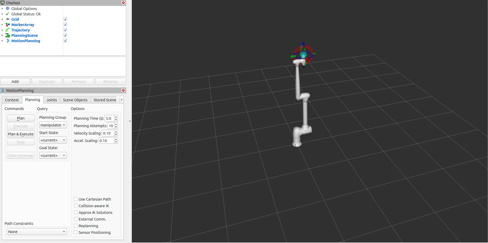
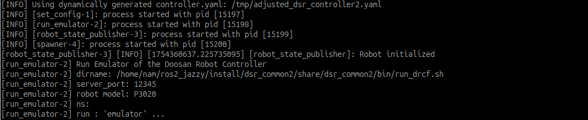
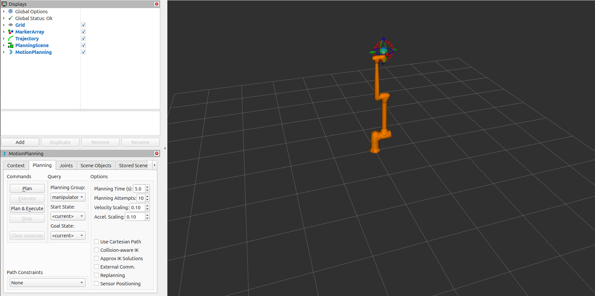
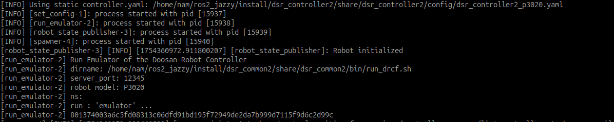

.. _moveit_advanced_tutorial:

MoveIt2 Dynamic YAML Launch Option
===================================

Overview
--------

This tutorial introduces an advanced usage of the MoveIt 2 launch system that supports both **dynamic** and **static** controller YAML configurations.

This mechanism is especially useful when:

- Simulating or controlling robots with custom or non-standard DOF (Degrees of Freedom)
- Deploying to different robot variants without manually maintaining multiple static configuration files

.. note::

   MoveIt 2 integration requires the following minimum Doosan Controller firmware versions:

   - **Firmware 2.x**: Version **2.12** or higher
   - **Firmware 3.x**: Version **3.4** or higher

Dynamic vs Static
-----------------

- **Dynamic YAML Generation**  |br|
  Automatically generates `controller.yaml` at runtime based on the robot model’s active and passive joints.

- **Static YAML Usage**  |br|
  Loads predefined YAML files like `dsr_controller2.yaml` or `dsr_controller2_<model>.yaml` from the `dsr_controller2/config/` folder.

For example, the **P3020** model (5-DOF) typically requires a modified static configuration file.  
The default `dsr_controller2.yaml` provided in the package is written for a 6-DOF robot.  
If you use the P3020 with a **static YAML** approach, you would need to manually edit a copy of this file so that it matches the 5-DOF configuration.  

However, with the **dynamic YAML** generation feature, you can keep the original `dsr_controller2.yaml` unchanged.  
At launch, the system automatically parses the URDF, identifies the robot’s actual number of actuated joints, and generates a temporary YAML file tailored to the 5-DOF P3020 model.  
This eliminates manual edits while ensuring MoveIt 2 uses the correct controller configuration.

.. raw:: html

     

Command 
-------

.. code-block:: bash

   ros2 launch dsr_bringup2 dsr_bringup2_moveit.launch.py [arguments]

Arguments
---------

- ``mode``: Operation mode (``real`` or ``virtual``)
- ``model``: Robot model name (e.g., ``m1013``, ``a0509``, ``p3020``)
- ``host``: IP address of the robot controller
- ``dynamic_yaml``: Set to ``true`` to auto-generate `controller.yaml`, or ``false`` to use static YAML files

.. raw:: html

     

Setup and Launch
----------------

Dynamic Controller YAML Generation
^^^^^^^^^^^^^^^^^^^^^^^^^^^^^^^^^^

.. code-block:: bash

   ros2 launch dsr_bringup2 dsr_bringup2_moveit.launch.py mode:=virtual model:=p3020 host:=127.0.0.1 dynamic_yaml:=true

This will:

- Parse the robot’s URDF to extract active and passive joints
- Dynamically create a temporary YAML configuration with only the robot’s actuated joints
- Apply this configuration to the controller manager without requiring manual file edits

.. raw:: html

     

Static Controller YAML (Model-Specific)
^^^^^^^^^^^^^^^^^^^^^^^^^^^^^^^^^^^^^^^

.. code-block:: bash

   ros2 launch dsr_bringup2 dsr_bringup2_moveit.launch.py mode:=virtual model:=p3020 dynamic_yaml:=false

This will:

- Search for a file named `dsr_controller2_p3020.yaml` in the `dsr_controller2/config/` folder
- If not found, fall back to the default `dsr_controller2.yaml` file

.. raw:: html

     

URDF / Xacro Requirements for Dynamic YAML
^^^^^^^^^^^^^^^^^^^^^^^^^^^^^^^^^^^^^^^^^^

To ensure the dynamic generator functions correctly, your robot model’s URDF (typically converted from `.xacro`) must:

- Clearly define **which joints are actuated vs passive**  
  (e.g., using `<joint type="fixed">` or a consistent naming convention)
- Include all joint names in a consistent order
- Use valid joint types (`revolute`, `prismatic`, etc.) that are compatible with `ros2_control`

Example snippet in `.xacro`:

.. code-block:: xml

   <joint name="joint_4" type="fixed">
     <origin xyz="0 -0.89 -0.1731" rpy="1.5708 0 0"/>
     <parent link="link_3"/>
     <child link="link_4"/>
   </joint>

This setup allows you to focus on the robot’s mechanical design while letting the system automatically adjust its control configuration for MoveIt 2 planning and execution.

For more detailed setup instructions, including recommended changes to URDF, Xacro macros, `ros2_control` plugin definitions, and associated YAML files |br|
(e.g., `initial_positions.yaml`, `ros2_controllers.yaml`, `joint_limits.yaml`),

please refer to the complete guide: 
:ref:`p3020_detailed_guide`

References
----------

- `Doosan ROS2 Manual <https://manual.doosanrobotics.com/en/ros/>`_
- `MoveIt2 Documentation <https://moveit.picknik.ai/main/doc/>`_
- `ROS2 Jazzy Documentation <https://docs.ros.org/en/jazzy/index.html>`_
