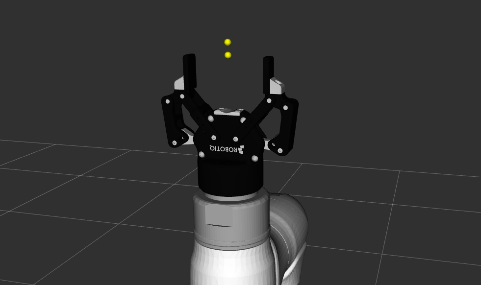
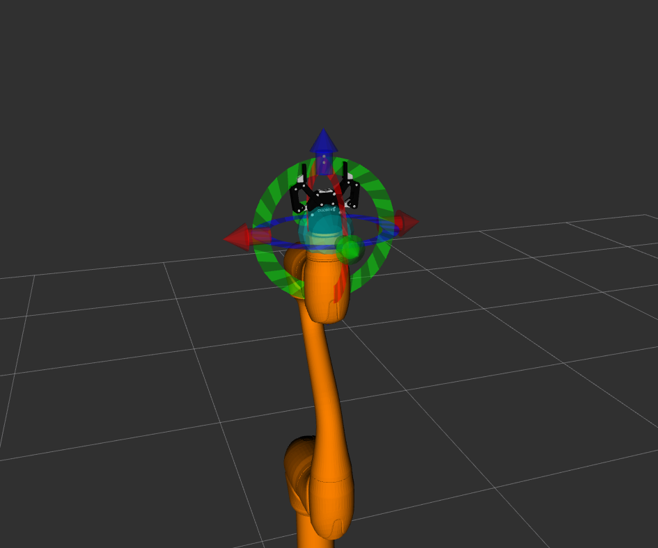
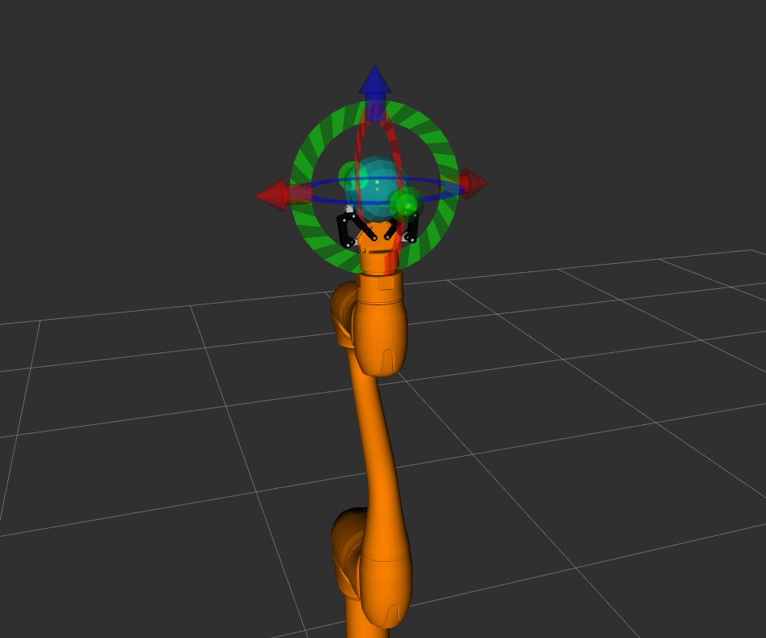
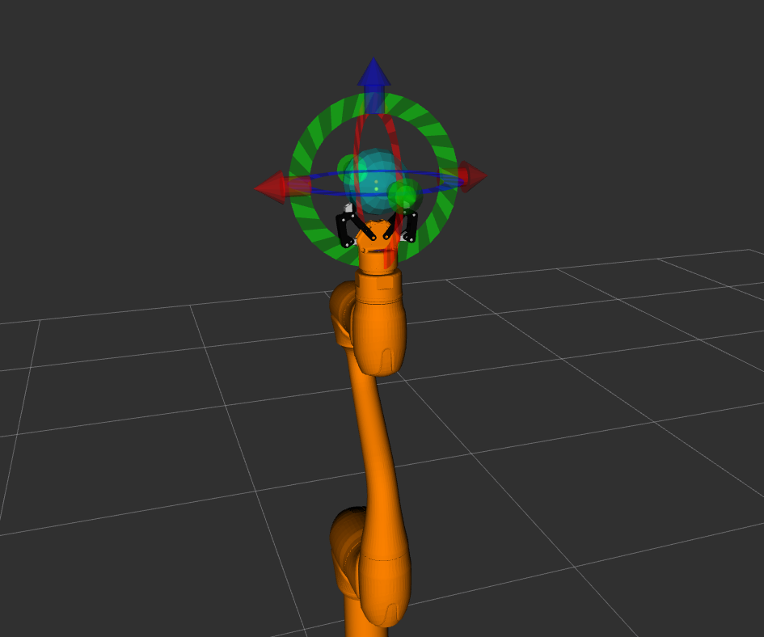

.. _moveit_gripper_advanced_tutorial:

MoveIt2 Launch with Gripper Option
===================================

Overview
--------

To start MoveIt 2 with a gripper, use the dsr_bringup2_moveit.launch.py launch file. You must specify your robot model and set the gripper argument to the desired model name.

Command 
-------

.. code-block:: bash

   ros2 launch dsr_bringup2 dsr_bringup2_moveit.launch.py model:=<robot_model> gripper:=<gripper_model>

Arguments
---------

- ``mode``: Operation mode (``real`` or ``virtual``)
- ``model``: Robot model name (e.g., ``m1013``, ``a0509``, ``p3020``)
- ``host``: IP address of the robot controller
- ``dynamic_yaml``: Set to ``true`` to auto-generate `controller.yaml`, or ``false`` to use static YAML files
- ``gripper``: The model of the gripper to attach. Set to ``none`` or blank to launch without a gripper.

.. note:: 
   
   Currently, only **2f85** model of **Robotiq** is supported.

.. raw:: html

     

Example
^^^^^^^

This command launches the m1013 robot with a Robotiq 2F-85 gripper in a virtual environment.

.. code-block:: bash

   ros2 launch dsr_bringup2 dsr_bringup2_moveit.launch.py model:=m1013 gripper:=robotiq_2f85

Upon successful launch, you will see the robot model with the gripper attached in RViz.

.. raw:: html

     

Controlling the Gripper
^^^^^^^^^^^^^^^^^^^^^^^

Once launched, the gripper can be controlled manually through the RViz interface
or by sending directly a goal to an action server.

In the RViz MotionPlanning panel, look or navigate to the Gripper Control. 
You can change the gripper state using the buttons.

.. image:: ../images/moveit/moveit_gripper.gif
   :alt: m1013_with_robotiq_2f85
   :width: 100%
   :align: center

.. raw:: html

     

You only need to move the ``robotiq_85_left_knuckle_joint`` for the gripper to open or close.

- Open Position: ``robotiq_85_left_knuckle_joint`` value of 0.0 corresponds to a fully open gripper.

- Closed Position: ``robotiq_85_left_knuckle_joint`` value of 0.8 corresponds to a fully closed gripper.

For controlling directly in terminal, the gripper exposes a gripper_cmd action server. 
You can send goals to this server using the ros2 action send_goal command.

.. code-block:: bash

   # Open the gripper
   ros2 action send_goal /gripper_position_controller/gripper_cmd control_msgs/action/GripperCommand   "{command: {position: 0.0, max_effort: 50.0}}

.. code-block:: bash

   # Close the gripper
   ros2 action send_goal /gripper_position_controller/gripper_cmd control_msgs/action/GripperCommand   "{command: {position: 0.8, max_effort: 50.0}}

Motion Planning with the Gripper
^^^^^^^^^^^^^^^^^^^^^^^^^^^^^^^^

To ensure accurate motion planning, we offer two additional end-effector definitions that account for the gripper's state. You can select the appropriate one from the Planning Group dropdown in the RViz MotionPlanning panel.

- (default) manipulator end-effector

.. raw:: html

     

- manipulator_gripper_opened: Use this group to plan trajectories where the end-effector accounts for the open fingers.

.. raw:: html

     

- manipulator_gripper_closed: Use this group to plan trajectories where the end-effector is the tip of the closed fingers.

.. raw:: html

     

Selecting the correct group ensures that MoveIt uses the right tool center point (TCP) for your task.

References
----------

- `MoveIt2 Documentation <https://moveit.picknik.ai/main/doc/>`_
