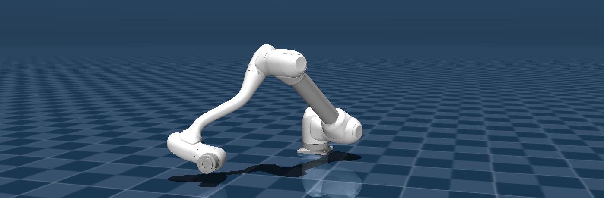

.. _mujoco_ros2_tutorial:

Launch with MuJoCo
====================

Overview
--------

This package enables controlling Doosan robots in the MuJoCo physics simulator using ROS 2. You can simulate various robot models in custom environments and interact with them using ROS 2 interfaces.

.. image:: ../images/mujoco/m1013_in_mujoco.png
   :alt: Doosan robot in MuJoCo
   :width: 800px
   :align: center

.. raw:: html

     

**Supported Models:**

- **H-SERIES**: h2515 (blue), h2017 (blue)
- **M-SERIES**: m1013 (white), m0609 (white), m1509 (white), m0617 (white)
- **A-SERIES**: a0509 (blue), a0912 (blue)
- **E-SERIES**: e0509 (white)

Prerequisites
-------------

1.  **Install MuJoCo**

    Download the appropriate version from the `official releases <https://github.com/google-deepmind/mujoco/releases>`_ and unzip it. For more details, refer to the `MuJoCo documentation <https://mujoco.org/>`_.
    Download the zip or tar.gz file with the name containing (linux-x86_64) and extract it to your designated location.”

2.  **Set Environment Variable**

    Add the ``MUJOCO_DIR`` environment variable to your ``~/.bashrc`` file. Make sure to replace the path and version with your specific installation details. 

    .. code-block:: bash

       export MUJOCO_DIR=/PATH/TO/MUJOCO/mujoco-3.x.x
       export PATH=$MUJOCO_DIR/bin:$PATH
       export LD_LIBRARY_PATH=$MUJOCO_DIR/lib:$LD_LIBRARY_PATH

3.  **Install MuJoCo ROS 2 Control Package**

    This package provides the ROS 2 interface for MuJoCo.

    .. code-block:: bash

       # Install dependencies
       sudo apt update && sudo apt install libglfw3-dev

       # Clone and build the package from a specific commit
       cd ~/ros2_ws/src
       git clone https://github.com/moveit/mujoco_ros2_control.git
       cd ~/ros2_ws
       colcon build
       source install/setup.bash

Command
-------

.. code-block:: bash

   ros2 launch dsr_bringup2 dsr_bringup2_mujoco.launch.py [arguments]

Arguments
---------

- ``model``: Name of the Doosan robot model. (Default: ``m1013``)
- ``gui``: Launch RViz2 GUI. (``true``/``false``, Default: ``true``)
- ``gripper``: Gripper model to attach. (Default: ``2f85``)
- ``scene_path``: Path to a custom MuJoCo XML scene file. (Default: ``none``)

Example
--------
**Launch a Robot in a Blank Scene**

This command launches the ``m1013`` robot in an empty MuJoCo environment. (every settings in default)

.. code-block:: bash

   ros2 launch dsr_bringup2 dsr_bringup2_mujoco.launch.py

In a new terminal you can run command to move the robot.

.. code-block:: bash

   ros2 run dsr_example dance

.. raw:: html

    

Pick & Place Demo
~~~~~~~~~~~~~~~~~

This example launches the ``m1013`` robot with a gripper in a pre-configured scene and runs a pick-and-place demonstration.

Launch m1013 with gripper in the demo scene:

.. code-block:: bash

   ros2 launch dsr_bringup2 dsr_bringup2_mujoco.launch.py model:=m1013 gripper:=2f85 scene_path:=demo/slope_demo_scene.xml

In a new terminal, run the Pick & Place script:

.. code-block:: bash

   ros2 run dsr_example slope_demo

.. figure:: ../images/mujoco/m1013_with_slide.png
   :alt: Watch Demo on YouTube
   :target: https://youtu.be/Jqaam6x79t4
   :width: 800px
   :align: center

.. raw:: html

    
    

Customizing the MuJoCo Environment
----------------------------------

You can create custom simulation environments by editing or creating new MuJoCo scene (``.xml``) files. 
Scene files are located in ``dsr_description2/mujoco_models/``. 
In these files, you can add or modify elements such as floor, lighting, and objects.

Key MuJoCo XML tags for customization include:

-   **<Compiler>**: Defines global simulation settings such as calculation methods. The ``meshdir`` attribute is critical for locating model asset files.

.. code:: xml

   <compiler angle="radian" meshdir="../" />

.. note::

   For the robot model to load successfully, meshdir should point to ``mujoco_models`` directory properly.

-   **<Option>**: Fine-tunes physics properties like contact models and integrators, which is important for stable grasping.

.. code:: xml

   <option cone="elliptic" impratio="200" integrator="implicitfast"/>

For detailed guidance on creating scenes, refer to the official `MuJoCo XML documentation <https://mujoco.readthedocs.io/en/stable/XMLreference.html>`_.

.. image:: ../images/mujoco/slope.png
   :alt: Dance Demo
   :width: 800px
   :align: center

.. raw:: html

    

.. tip::
   Use MuJoCo's native simulator to quickly test and debug your scene files: ``./simulate <your_scene.xml>``. The ``simulate`` executable is in the ``bin`` folder of your MuJoCo installation.

Gripper Operation
-----------------

Unlike the main DSR manipulators, grippers should use individual ROS 2 controllers.

2F85 Gripper Example
~~~~~~~~~~~~~~~~~~~~

The 2F85 gripper uses the ``forward_command_controller/ForwardCommandController``, which is a standard ROS 2 controller.

This controller manages the left_driver_joint of the gripper by ``/{ns}/mj/left_knuckle_position_controller/commands`` topics.

You can find an example of its usage in the ``dsr_example2/dsr_example/dsr_example/demo/slope_demo.py`` script.

.. image:: ../images/mujoco/m1013_2f85.png
   :alt: Dance Demo
   :width: 800px
   :align: center

.. raw:: html

    

To control the gripper from the terminal, publish a ``Float64MultiArray`` message to the ``/dsr01/mj/left_knuckle_position_controller/commands`` topic.

- **Open Gripper:**

  .. code-block:: bash

     ros2 topic pub /dsr01/mj/left_knuckle_position_controller/commands std_msgs/msg/Float64MultiArray "{data: [0.0]}"

- **Close Gripper:**

  .. code-block:: bash

     ros2 topic pub /dsr01/mj/left_knuckle_position_controller/commands std_msgs/msg/Float64MultiArray "{data: [0.8]}"

References
----------

- `MuJoCo Documentation <https://mujoco.org/>`_
- `mujoco_ros2_control Package <https://github.com/moveit/mujoco_ros2_control>`_