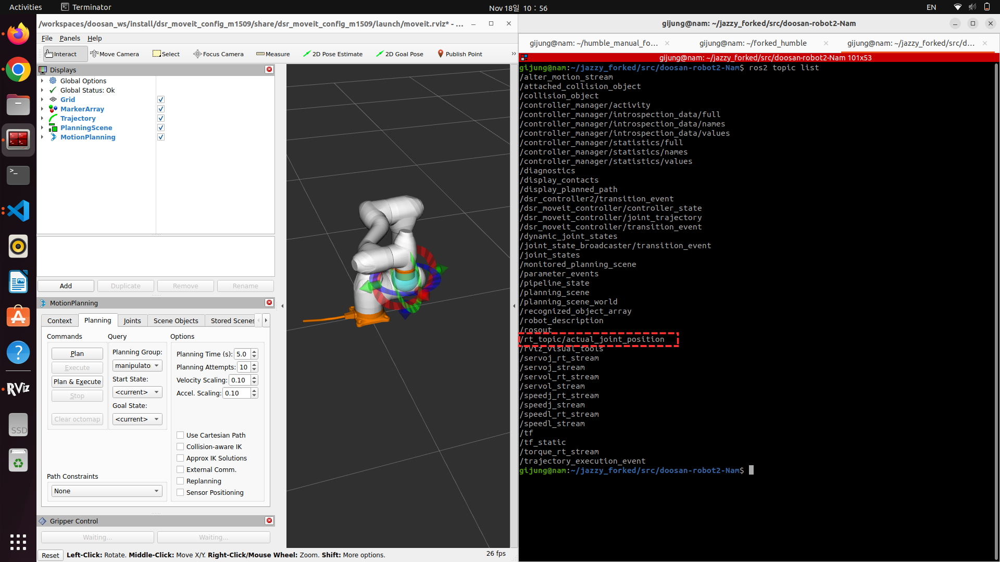

.. _rt_topic_tutorial:

rt_topic Publish Tutorial
=========================

Overview
--------
The ``rt_topic`` feature enables real-time publishing of selected robot data fields
through the ``read_data_rt`` service. This allows low-latency streaming of joint states,
torques, sensor readings, and various controller data for applications requiring
high-frequency monitoring or fast control loops.

The ``rt_topic`` system retrieves internal controller data using the
``read_data_rt`` service and maps each selected data field to a user-defined string key.
Each key becomes a dedicated ROS 2 topic under the namespace: ``/rt_topic/<key>``

This mechanism is suitable for:

- High-frequency robot state monitoring  
- External control loops requiring low latency  
- Real-time diagnostics and visualization  
- Logging or streaming raw sensor feedback

.. warning::

   This feature is supported **only in real mode**.  
   Values returned in **virtual mode** are not valid and should not be used.

.. raw:: html

     

Prerequisites
-------------

The feature is included in the ``doosan-robot2`` Humble distribution.  
Ensure that the package is correctly installed before continuing.

For installation instructions, refer to: :ref:`installation`

.. raw:: html

     

Setup and Launch
----------------

**1. Modify dsr_controller2.yaml Parameters**
~~~~~~~~~~~~~~~~~~~~~~~~~~~~~~~~~~~~~~~~~~~~~~~

To enable RT topic publishing, configure the following parameters in:

``dsr_controller2/config/dsr_controller2.yaml``

Parameter descriptions:

- ``use_rt_topic_pub``  
  Enables or disables RT topic publishing.

- ``rt_timer_ms``  
  Sets the publishing interval (ms).

- ``rt_topic_keys``  
  Specifies the list of field names to publish.  
  Each entry generates a topic under ``/rt_topic/<key>``.

Example configuration:

.. code-block:: yaml

    dsr_controller2:
      ros__parameters:
        joints:
          - joint_1
          - joint_2
          - joint_3
          - joint_4
          - joint_5
          - joint_6

        # rt_data topic configuration
        use_rt_topic_pub: true
        rt_timer_ms: 10                      # Publish interval in ms
        rt_topic_keys:                       # Field names for RT publishing
          - actual_joint_position

**2. Launch the Controller**
~~~~~~~~~~~~~~~~~~~~~~~~~~~~

The RT topic publisher is automatically started when the
``dsr_controller2`` node is launched.  
Any launch file that initializes the controller—such as the Gazebo, MoveIt2,
or RViz demos—will activate the feature if configured in the YAML file.

Refer to: :ref:`basic_tutorials`

.. raw:: html

     
   
rt_topic_keys
-------------

The following keys are valid entries for ``rt_topic_keys``.  
Each key corresponds to a data field available from the ``read_data_rt`` service.

Example usage:

.. code-block:: yaml

    use_rt_topic_pub: true
    rt_timer_ms: 10
    rt_topic_keys:
      - actual_joint_position
      - actual_flange_position

1. 6-element float array fields (size = 6)
~~~~~~~~~~~~~~~~~~~~~~~~~~~~~~~~~~~~~~~~~~

.. code-block:: text

    actual_joint_position
    actual_joint_position_abs
    actual_joint_velocity
    actual_joint_velocity_abs
    actual_tcp_position
    actual_tcp_velocity
    actual_flange_position
    actual_flange_velocity
    actual_motor_torque
    actual_joint_torque
    raw_joint_torque
    raw_force_torque
    external_joint_torque
    external_tcp_force
    target_joint_position
    target_joint_velocity
    target_joint_acceleration
    target_motor_torque
    target_tcp_position
    target_tcp_velocity
    gravity_torque
    joint_temperature
    goal_joint_position
    goal_tcp_position

2. 6×6 matrix fields (size = 36)
~~~~~~~~~~~~~~~~~~~~~~~~~~~~~~~~

.. code-block:: text

    coriolis_matrix
    mass_matrix
    jacobian_matrix

3. 2-element fields (size = 2)
~~~~~~~~~~~~~~~~~~~~~~~~~~~~~~

.. code-block:: text

    controller_analog_input_type
    controller_analog_input
    controller_analog_output_type
    controller_analog_output
    external_encoder_strobe_count
    external_encoder_count

4. 4-element fields (size = 4)
~~~~~~~~~~~~~~~~~~~~~~~~~~~~~~

.. code-block:: text

    flange_analog_input

5. Scalar fields
~~~~~~~~~~~~~~~~

.. code-block:: text

    time_stamp
    solution_space
    singularity
    operation_speed_rate
    controller_digital_input
    controller_digital_output
    flange_digital_input
    flange_digital_output.. image:: ../images/etc/rt_topic.png
   :alt: Doosan robot rt_topic
   :width: 800px
   :align: center
    robot_mode
    robot_state
    control_mode

.. raw:: html

     

.. image:: ../images/etc/rt_topic.gif
   :alt: Doosan robot rt_topic
   :width: 800px
   :align: center