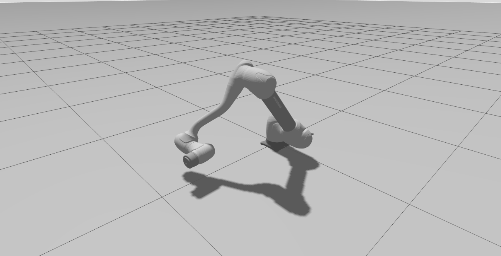
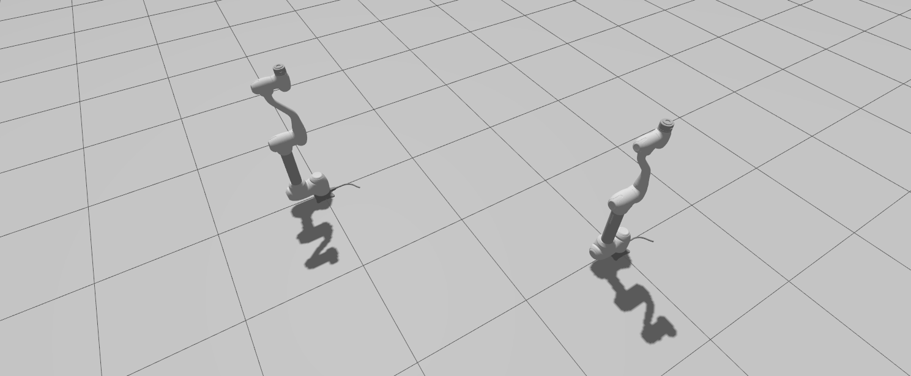

.. _gazebo_tutorial:

Gazebo Simulation
=================

This launch file starts the robot in the Gazebo simulator with optional RViz2.

Command
--------

.. code-block:: bash

   ros2 launch dsr_bringup2 dsr_bringup2_gazebo.launch.py [arguments]

Arguments
---------

- ``mode``: Operation mode  
  - ``real``: Connect to a physical Doosan robot  
  - ``virtual``: Run in emulator/simulation mode

- ``model``: Robot model name (e.g., ``m1013``, ``a0509``, ``p3020``)
- ``host``: IP address of robot controller or emulator
- ``port``: Port for DRCF emulator (default: ``12345``)
- ``x, y``: Initial spawn position in Gazebo

Examples
----------

**Real Mode (Physical Robot)**

  This will connect to the real robot enabling motion control for both the real and simulated robots.

  .. code-block:: bash

     ros2 launch dsr_bringup2 dsr_bringup2_gazebo.launch.py mode:=real host:=192.168.137.100 model:=m1013

**Virtual Mode (Simulation)**

  .. code-block:: bash

     ros2 launch dsr_bringup2 dsr_bringup2_gazebo.launch.py mode:=virtual host:=127.0.0.1 port:=12346 model:=m1013 x:=0 y:=0

  .. image::  ../images/gazebo/gazebo_launch.png
     :alt: Robot Model Preview
     :width: 800px
     :align: center

Test Motion Example
~~~~~~~~~~~~~~~~~~~~~

Once Gazebo is running, you can test the setup by executing a simple motion script.

Open a new terminal and run the following command:

.. code-block:: bash

    ros2 run dsr_example dance

.. raw:: html

    
    

Multi-Arm Simulation
--------------------

You can spawn multiple robots in Gazebo for **multi-arm coordination** and visualization.

.. note::

   Each robot must have a unique ``name``, ``port``, and ``x/y`` location to prevent collision.  
   Multiple emulators will increase CPU usage and may impact performance.

**Step 1. Launch First Robot**

.. code-block:: bash

   ros2 launch dsr_bringup2 dsr_bringup2_gazebo.launch.py mode:=virtual host:=127.0.0.1 port:=12345 name:=dsr01 model:=m1013 x:=0 y:=0 color:=white

**Step 2. Spawn Second Robot**

.. code-block:: bash

   ros2 launch dsr_bringup2 dsr_bringup2_spawn_on_gazebo.launch.py mode:=virtual host:=127.0.0.1 port:=12347 name:=dsr02 x:=2 y:=2

.. raw:: html

    
    
   
References
----------

- `Gazebo Tutorials <https://gazebosim.org/docs/harmonic/tutorials/>`_
- `Doosan ROS2 Manual <https://manual.doosanrobotics.com/en/ros/>`_
- `Gazebo multi arm demo video <https://github.com/user-attachments/assets/bd91aea0-b8b6-4ce1-9040-9ab06630edbe>`_