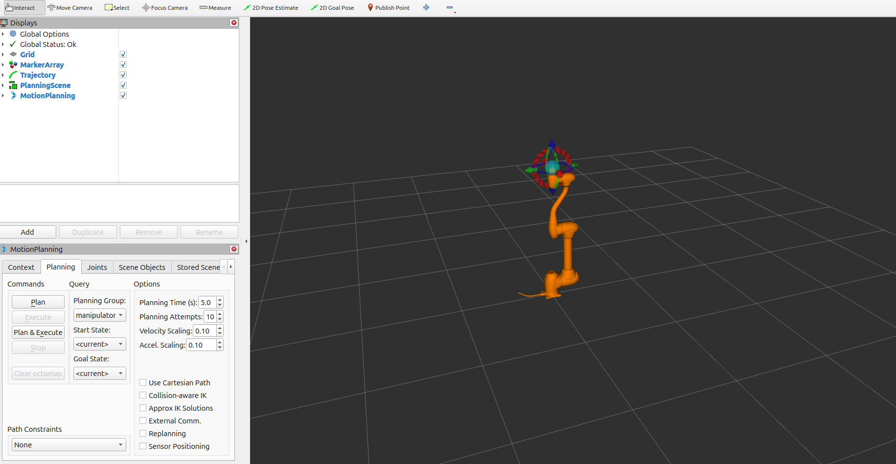

.. _moveit_tutorial:

MoveIt2 Integration
====================

MoveIt 2 provides motion planning, collision checking, and interactive manipulation capabilities for Doosan robots using the ROS 2 control stack.

.. note::

   MoveIt 2 integration requires the following minimum Doosan Controller firmware versions:

   - **Firmware 2.x**: Version **2.12** or higher
   - **Firmware 3.x**: Version **3.4** or higher

Command
-------

.. code-block:: bash

   ros2 launch dsr_bringup2 dsr_bringup2_moveit.launch.py [arguments]

.. caution::
   The Gazebo/RViz2 GUI may not appear due to missing X11 permissions
   (especially when using Docker or a remote session). Run the commands
   below **once per login (and after a reboot)** before launching.

   .. code-block:: shell

      xhost +                         # allow everyone; use only temporarily

   **These permissions reset after logout or reboot; re-apply as needed.**

Arguments
---------

- ``mode``: Robot operation mode. Options:
  
  - ``real``: Connect to a physical Doosan robot.
  - ``virtual``: Run in simulator or emulator mode.
  
- ``model``: Robot model name (e.g., ``m1013``, ``a0509``)
- ``host``: IP address of the robot controller (real mode) or emulator (virtual mode)

Examples
--------

**Real Mode (Physical Robot)**

.. code-block:: bash

   ros2 launch dsr_bringup2 dsr_bringup2_moveit.launch.py mode:=real model:=m1013 host:=192.168.137.100

**Virtual Mode (Simulation)**

.. code-block:: bash

   ros2 launch dsr_bringup2 dsr_bringup2_moveit.launch.py mode:=virtual model:=m1013 host:=127.0.0.1

Launching this command will start:

- RViz 2 with the robot model and planning scene
- Move Group (motion planning backend)
- Joint trajectory controller
- Robot state publisher and static transforms

.. raw:: html

     

.. raw:: html

     

Motion Execution Demo
---------------------

The animation below demonstrates motion execution using MoveIt 2:

.. image:: ../images/moveit/moveit.gif
   :alt: MoveIt Motion Execution
   :width: 100%
   :align: center

.. raw:: html

     

For additional customization or troubleshooting, refer to the launch files in the ``dsr_bringup2`` and ``dsr_moveit_config_{model}`` packages.
