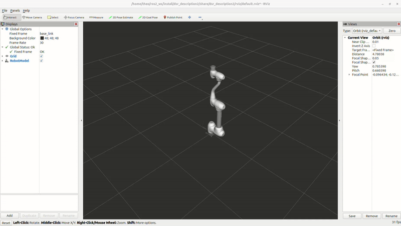

.. _rviz_tutorial:

RViz2 Launch
============

This launch file starts Rviz2 for visualizing the robot model and its state.

Command
--------

.. code-block:: bash

   ros2 launch dsr_bringup2 dsr_bringup2_rviz.launch.py [arguments]

Arguments
----------

- ``mode``: Robot operation mode. Choose between:
  
  - ``real``: Connect to physical Doosan robot.
  - ``virtual``: Run in simulator/emulator mode.
  
- ``model``: Robot model name (e.g., ``m1013``, ``a0509``, etc.)
- ``host``: IP address of the robot controller (real mode) or emulator (virtual mode)

Examples
----------

Launch
~~~~~~~~~~

To ensure proper launch and connection, the ``mode`` and ``host`` arguments should be configured accordingly.

- Using a real robot:

  Establish an Ethernet connection with your PC.

  Verify the IP address on the robot controller and ensure it matches the connection settings.

  .. code-block:: bash

     ros2 launch dsr_bringup2 dsr_bringup2_rviz.launch.py mode:=real host:=192.168.137.100 model:=m1013

- Using a virtual robot:

  Virtual IP address will always be ``127.0.0.1``.

  .. code-block:: bash

     ros2 launch dsr_bringup2 dsr_bringup2_rviz.launch.py mode:=virtual host:=127.0.0.1 model:=m1013

  .. image:: ../images/rviz/rviz1.png
     :alt: Robot Model Preview
     :width: 800px
     :align: center

  .. raw:: html

       
       

- Launch with different model and configurations:

  .. image:: ../images/rviz/m0609_launch_rviz2.png
     :alt: Robot Model Preview
     :width: 800px
     :align: center

  .. code-block:: bash

     ros2 launch dsr_bringup2 dsr_bringup2_rviz.launch.py mode:=virtual host:=127.0.0.1 model:=m0609

  .. image:: ../images/rviz/h2017_launch_rviz2.png
     :alt: Robot Model Preview
     :width: 800px
     :align: center

  .. code-block:: bash

     ros2 launch dsr_bringup2 dsr_bringup2_rviz.launch.py mode:=virtual host:=127.0.0.1 model:=h2017 color:=blue

  .. note::
     You can check the available robot models in the ``dsr_description2`` package.

Example move
~~~~~~~~~~~~

Once RViz2 is running, you can test the setup by executing a simple motion script.

Open a new terminal and run the following command:

.. code-block:: bash

    ros2 run dsr_example single_robot_simple

.. note::
   
      Example scripts are available in ``dsr_example2`` package.

Or you can directly move the robot by calling a service or topic :

.. code-block:: bash

    ros2 service call /dsr01/motion/move_joint dsr_msgs2/srv/MoveJoint "{
         pos: [0.0, 0.0, 90.0, 0.0, 90.0, 0.0],
         vel: 100.0,
         acc: 100.0,
         time: 2.0,
         mode: 0,
         radius: 0.0,
         blend_type: 0,
         sync_type: 0
         }"

.. image:: ../images/rviz/rviz2_launch_service_call.gif
   :alt: MoveIt Motion Execution
   :width: 100%
   :align: center

.. raw:: html

    
    